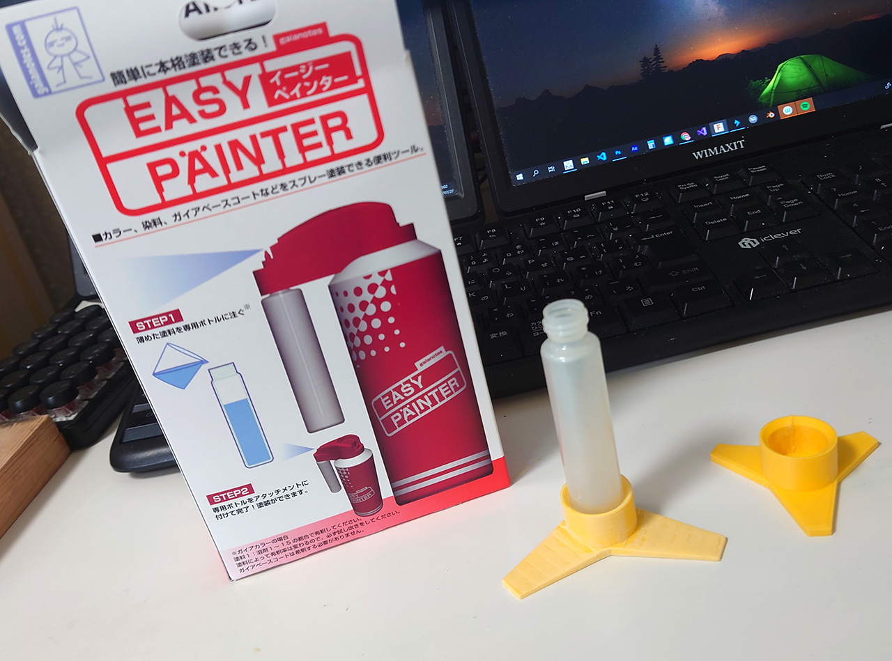
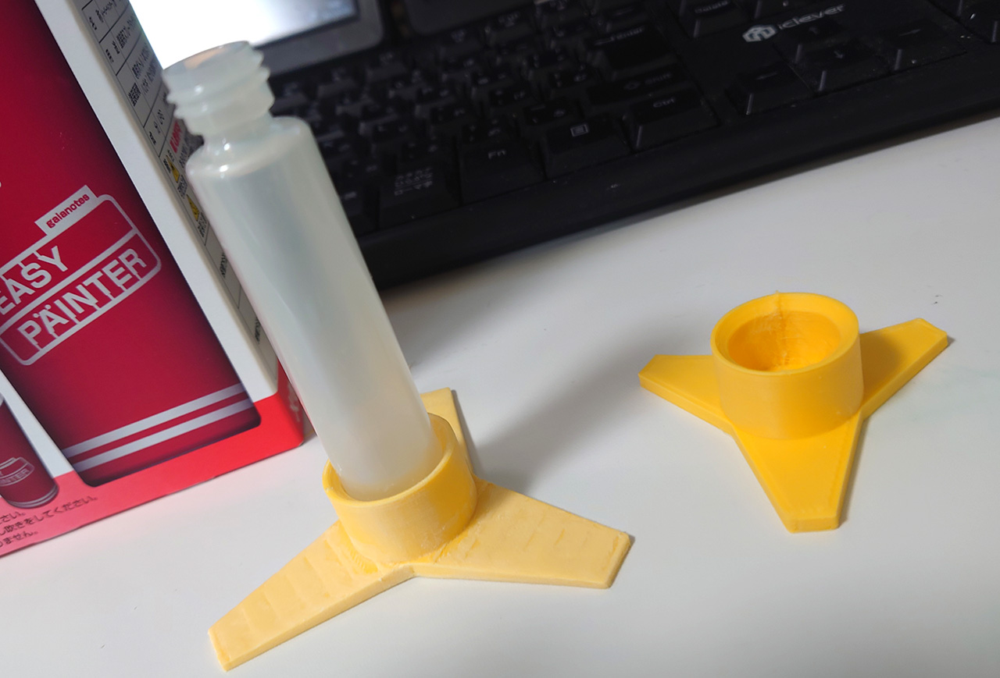

# イージーペインター　ボトルフォルダ
2021/07/27 

ガイアノーツの「イージーペインター」で塗装をしたら予想以上に良かった。 
でも、ボトルが倒れやすく複数本用意したくても扱いに困ったので作ったボトルフォルダです。 

 
左が試作品。ボトルがはまらなくて・少し大きすぎたので右のものに変更。 
もったいなかったので試作品はルーターで削って使えるようにした。積層の段差もついでに削った。
 

# Authors

bry-ful(Hiroshi Furuhashi)
twitter:[bryful](https://twitter.com/bryful)
bryful@gmail.com

