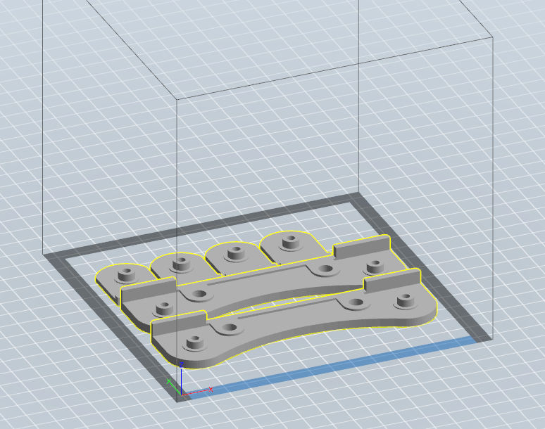

# フィラメントスプールホルダー

[https://www.thingiverse.com/thing:2384414](https://www.thingiverse.com/thing:2384414)

このスプールホルダがなかなか良かったので使っていましたが、いろいろあって改造しました。

* ベアリングがはまらない・すっぽ抜ける ネジ止めするようにしました。
* 倒れる・左右がだんだんずれていく 長ネジで左右のパーツを固定化しました。
 
ネジで固定するなら2枚でベアリングを挟む必要を感じなくなったので、現在の形になりました。 

# 必要なもの

stlフォルダにあるA.stl/B.stlがデータです。Aを2枚、Bを4枚印刷してください。

* M3x20mmのなべねじ　4セット。ワッシャーも必要です。
* M6x80mmの長ねじ  Flashforgeの1Kgのもの。500gの場合は70mmでも大丈夫です。

後滑り止めをつけておいた方がいいです。 
僕は適当な滑り止めゴムシートを適当に切って両面テープで貼り付けています。  

# License

オリジナルの条件に従ってください。

# Authors

bry-ful(Hiroshi Furuhashi)
twitter:[bryful](https://twitter.com/bryful)
bryful@gmail.com

