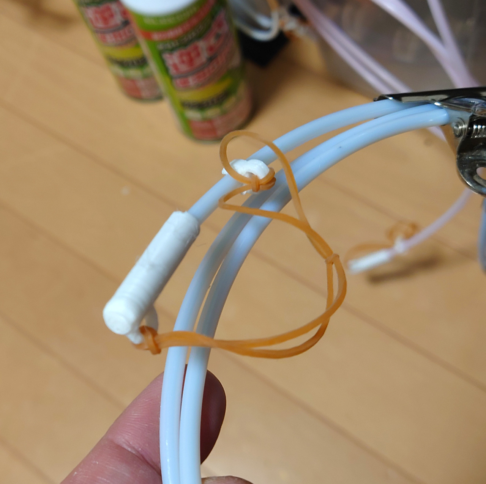

# チュープキャップ

フィラメントを入れたドライボックスからのテフロンチューブの先端につけるキャップです。

 
まぁ、Fusion360の練習として作ったものです 
 

* 転がってなくなるので、転がり防止のわっかをつけた。
* それでもなくなるので、紐で止められるアダプタも作成。
* いい紐がないから輪ゴムを使う。でも、使い勝手が良かったからそのままにしてます。見た目はわるいですが。

プリンタの調子が悪いと途中で崩れますが、それでも問題なく使ってます。 
 
印刷するときは充填率100%です。 

# Authors

bry-ful(Hiroshi Furuhashi)
twitter:[bryful](https://twitter.com/bryful)
bryful@gmail.com

