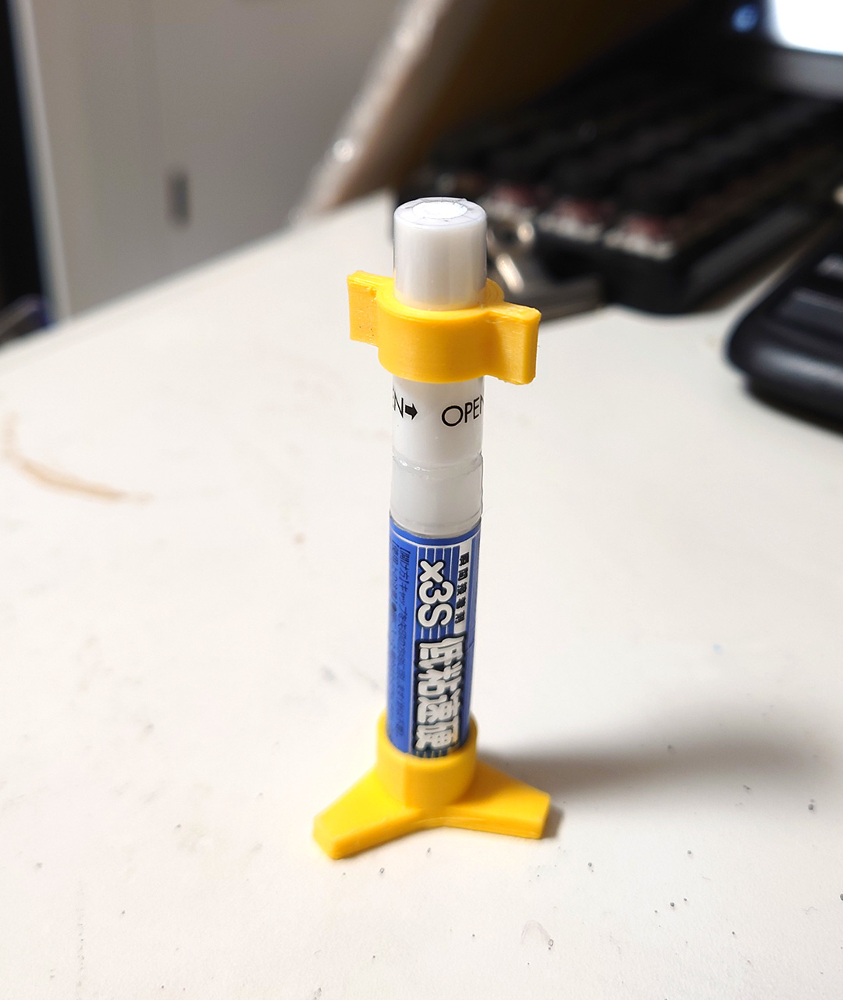
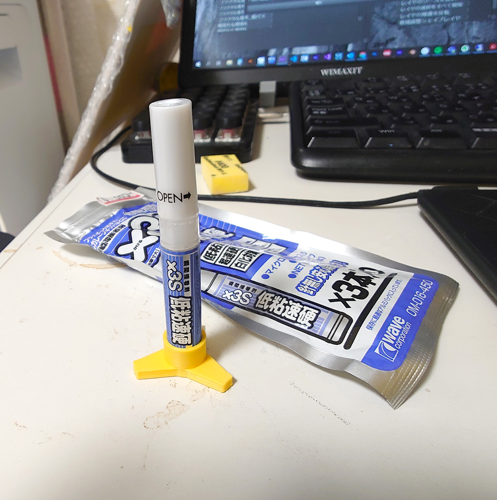

# Wave瞬間接着剤スタンド

2021/08/29 

蓋にも転がり防止のキャップを作りました。

 

2021/08/25 

Waveの瞬間接着剤が値段の割に使いやすかったので、最近使ってます。
ただ横にしておくと先が詰まってしまうので、自立できるスタンドを作りました。

 
 

# Authors

bry-ful(Hiroshi Furuhashi)
twitter:[bryful](https://twitter.com/bryful)
bryful@gmail.com

