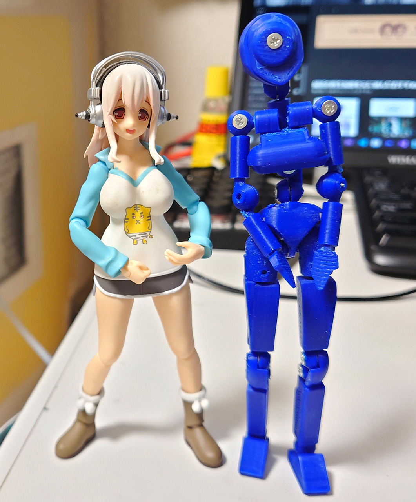
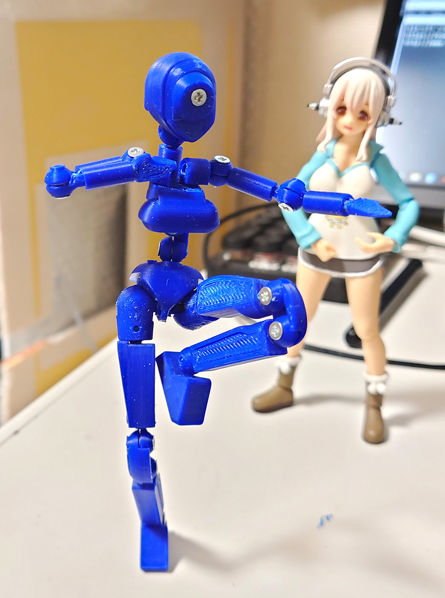
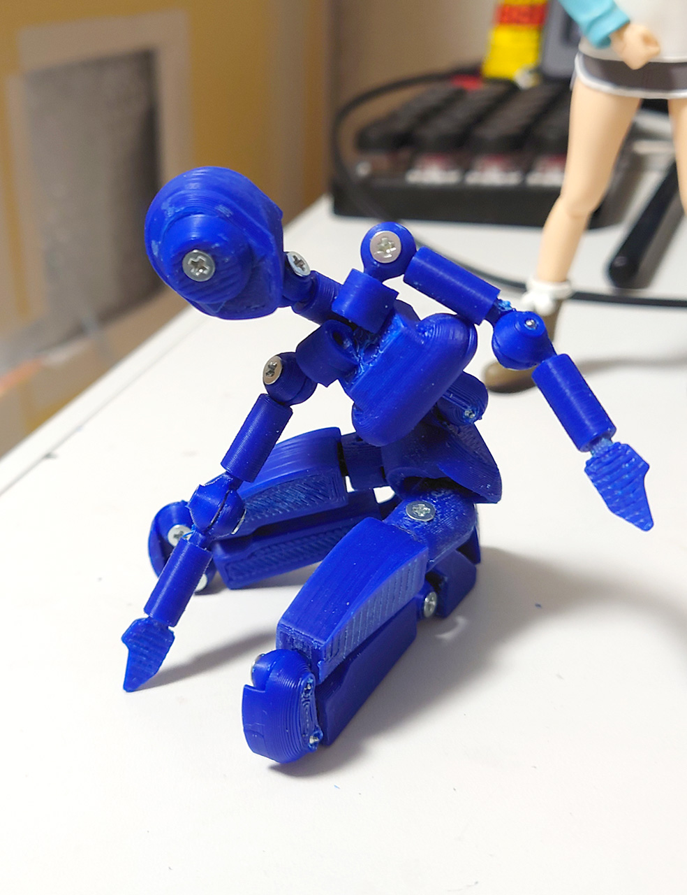
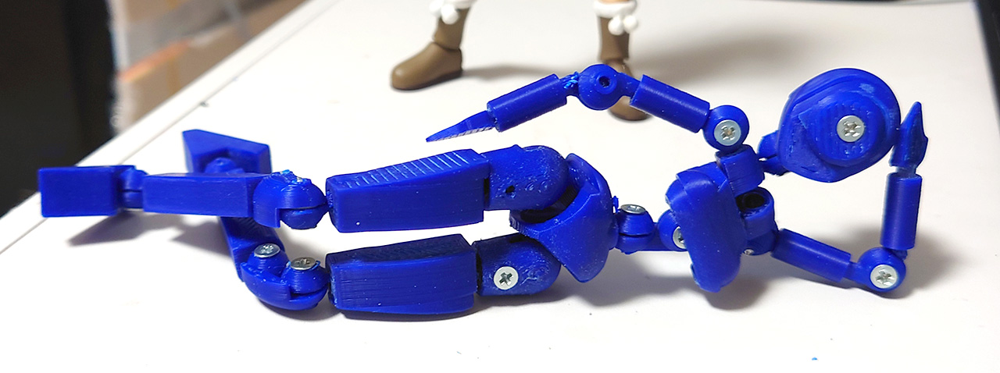
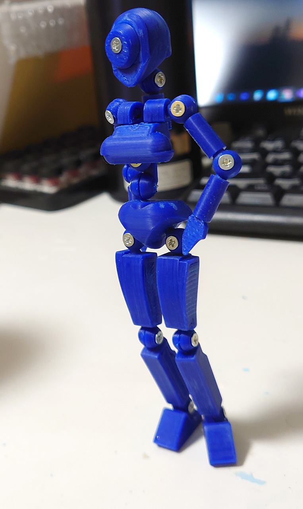
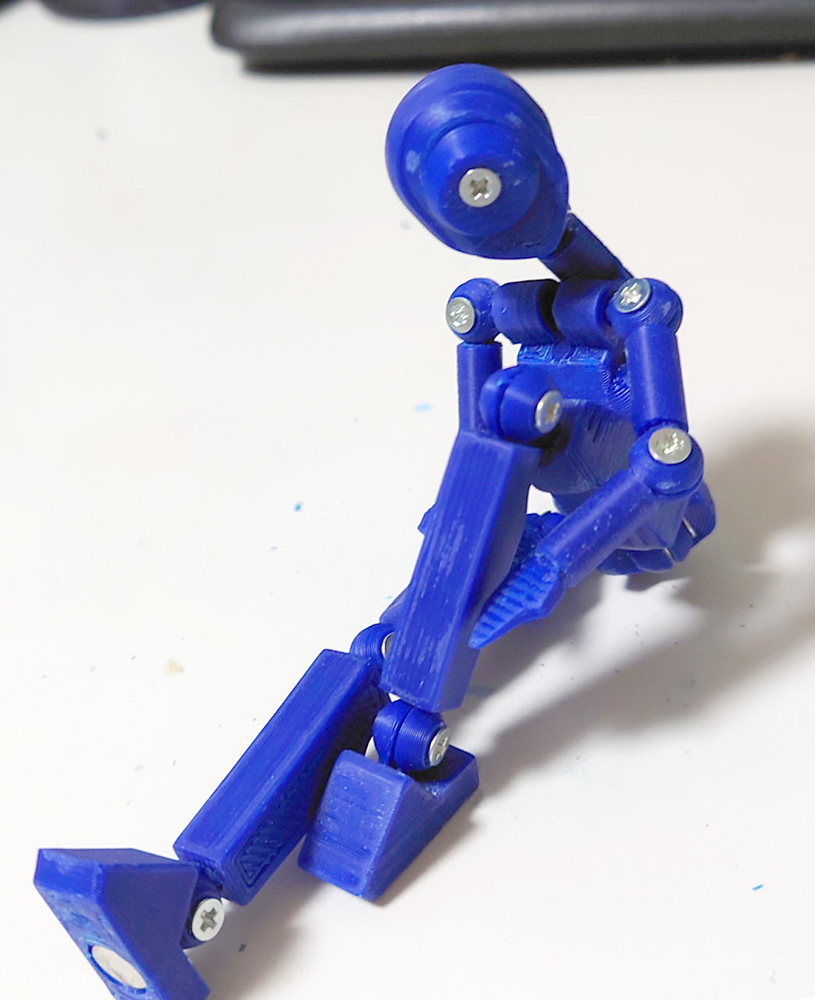
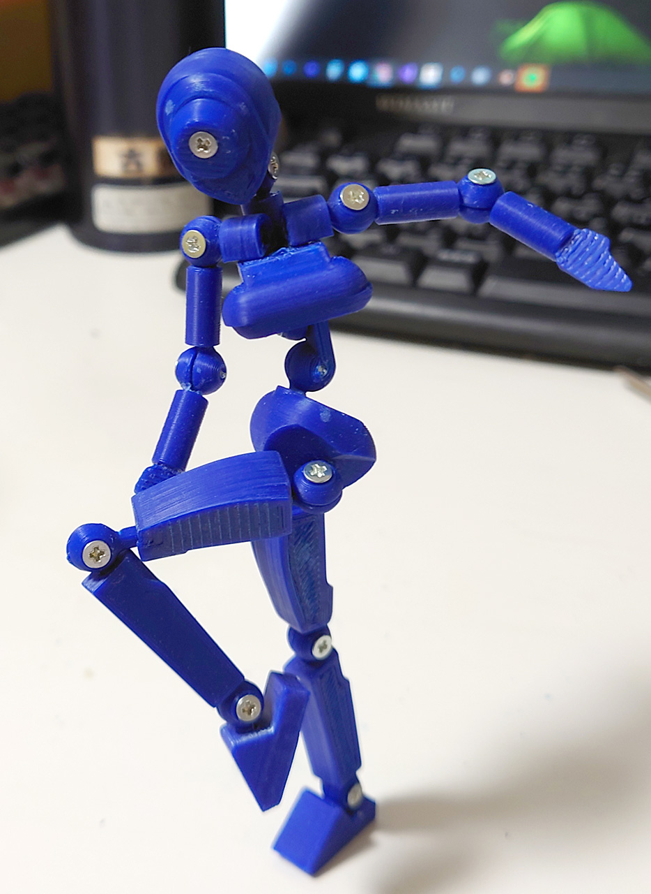
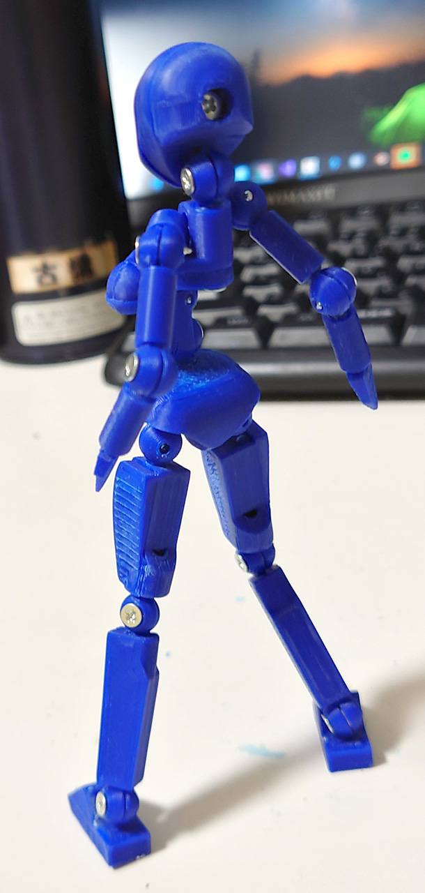

# 丸関節関節素体
2021/08/12 
関節だけ自由度を考慮して作った。 
股関節はボールジョイントにしてみた。前は全然駄目だったけどはめ合いとかいろいろ考慮すると割とうまくいった。
 

関節を見直したのでかなり自由度があがった。 
腰の関節がいまいちだな。
 
かなり無茶なポーズも取れるようになった。
 
今回作らなかった首の軸とか足首、手首が動かないのはちょっと悲しい。まぁテストなので。
 

2021/08/11 
はめ込み型の球形関節のテストのために作った素体。 
単純に作ったら関節の自由度がかなり悪かった。これは直さないと。あと、股関節は専用のものを作らないと駄目だなぁ。前に諦めたボールジョイントに挑戦しようか・
 
 
 
 

# Authors

bry-ful(Hiroshi Furuhashi)
twitter:[bryful](https://twitter.com/bryful)
bryful@gmail.com

