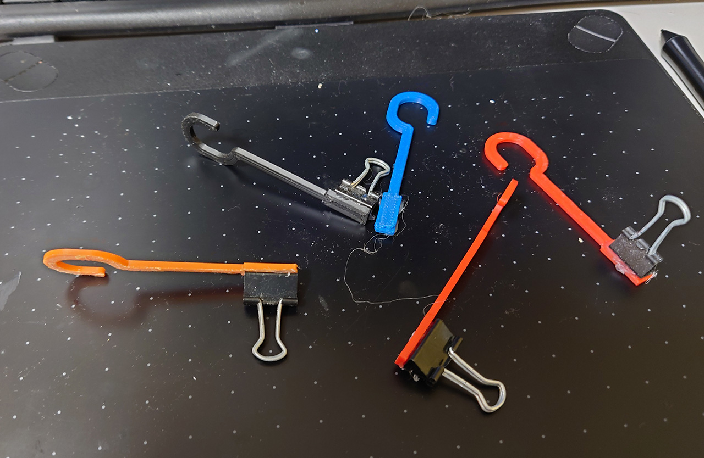
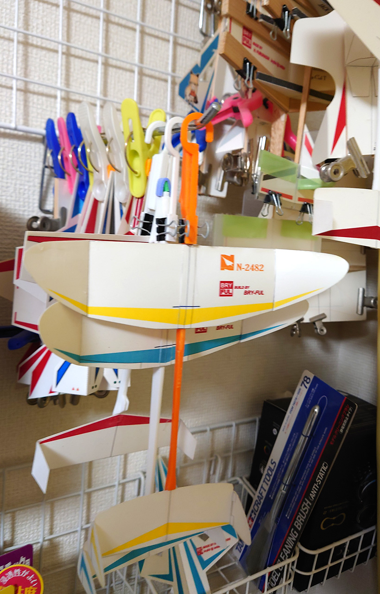
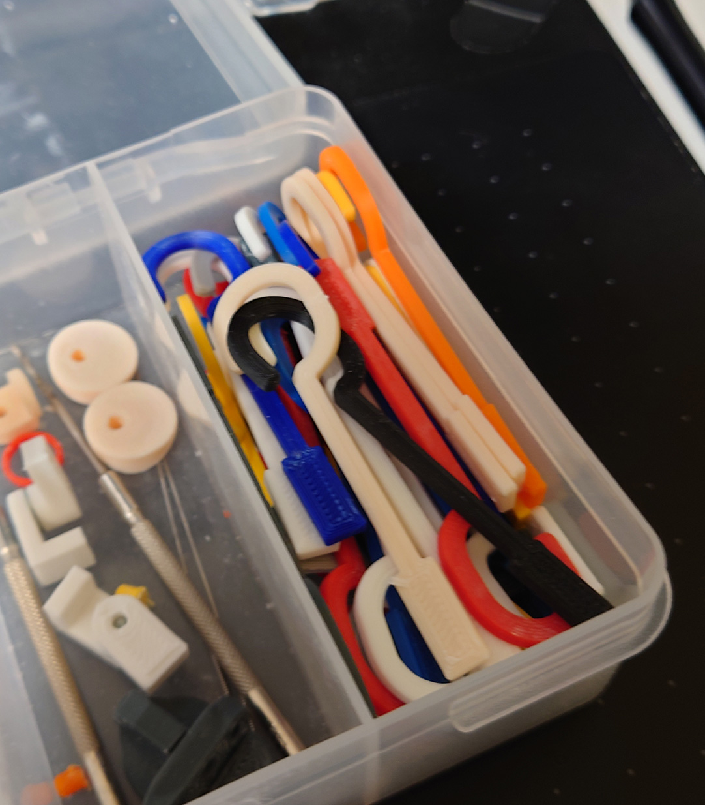

# 吊り下げフック

2021/06/06 

紙飛行機を吊り下げるフック。 
クリップをグルーガンで接着して使います。 
 

今までは洗濯ばさみでつけてましたが機種のクッションを変形させてしまうので、これを作りました。

 
でも、ほとんどは印刷時の調子を見るためのテスト用データとして毎日1個は必ず印刷してます。 

# Authors

bry-ful(Hiroshi Furuhashi)
twitter:[bryful](https://twitter.com/bryful)
bryful@gmail.com

