# FDM印刷におけるロボット関節のメモ

これは僕がロボットをデザイン印刷した時のメモをまとめたものです。 
今後の作業で忘れないためにここに記録します。 
 
僕の場合は基本的にABS印刷になります。PLAその他のマテリアルの場合はこのメモは役に立ちません。 

## 関節の必要条件
ロボット等の可動フィギュアの関節には自由に動かせる事と自由な位置で静止させる事の２点が要求されます。 
インターネットのアクションフィギュアの記事を読むとその事を「渋さ」と表現してものが多いです。ので、このメモでも関節の状態を「渋さ」と表記してます。

***

## スライサー設定

* 充填率は15%で十分
* 壁の厚さはタッピングネジを使用時は５枚以上

強度を増すために重点率を100%にしていたが時間がかかるだけで全く意味がなかった。
側面・底面・上面の壁の厚さが強度に関係する。 
積層ピッチが0.2mmの場合は５層位（つまり1mm幅）あれば研磨にも耐える強さがでる。 
積層ピッチを0.1mmにした時は10層は欲しい。がすごい時間かかるので0.18mmの５層にしている。 
 
<b>部分的に強度が欲しい時はデザイン時に0.1mm程度の穴をあけてそこに壁が出来るようにする。0.1mmだと実際は穴は開かないが壁はできるので強度が増す。</b> 
100%充填率は印刷速度を遅くするだけでデメリットが多いから注意の事。 
100%充填率で印刷しても気泡とか隙間とか結構あるから脆いところは脆い。

***

## はめ込み関節
### 簡易はめ込み関節
一番基本となる回転軸。穴とそれに合わせた円柱のはめ込みにより、固定と１軸回転を行う。
穴の側面と軸の表面の摩擦により固定と回転を行う。 
 
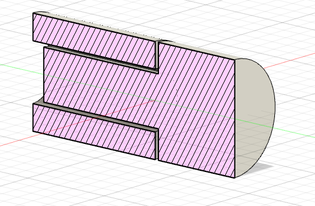 
 
3mm等のガンプラで使われている軸径ならポリキャップ等プラモのパーツがそのまま使える。
 
デメリットが多いのであまり使わなくなったが、腕や足のひねり軸にはたまに使う。 
デザインしやすいので股関節や肩関節等の小さく収めた箇所に使いたいが、摩耗によるゆるみが酷いので実際には使えない。 
印刷物をパーツ分けしてあって関節として動かさない場合はデザインにあまり影響を与えないので3mm軸でのはめ込みをよく使ってます。

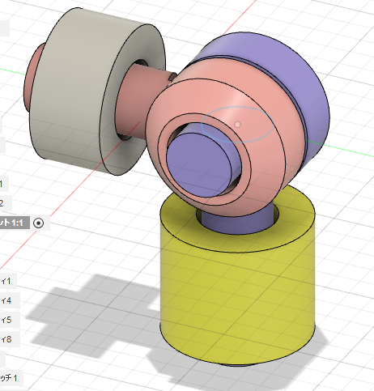 
XYZの３軸関節の例です。シンプルな構造ですが、印刷してみるとあまり良い感じではありません。 

#### デザイン時の注意。
印刷時に膨らむので3mm軸の場合、メス（穴）側は3.2mm、オス(軸)側は2.8mmとふくらみを考慮したサイズにする。この場合は0.2mm太るとした例 
太る量は印刷環境・材質・積層方向によって異なるので事前にテスト印刷を行い確認する。 
<b>FDM印刷で印刷した3mm軸はかなり精度が悪いのでそれを考慮すること!</b>
 
僕の場合は、両側をメス穴として、軸印刷はあきらめてタミヤの3mmプラ棒やアルミ棒を使っていることが多い。穴はドリルでかなり正確なサイズにすることが容易なので。 

軸の渋さ調整は、軸幅と軸長のデザイン時によるものしかない。瞬間接着剤によって軸幅の調整もできるがかなり面倒。後は水性ニスや木工用ボンドくらい。 

#### メリット
* 構造が簡単なのでデザインしやすい。
* 円柱構造のひねり軸には使いやすい。
* 関節としてではなく印刷物の固定接続として気楽に使える。

#### デメリット
* 軸の調整が難しい。やすりでの削りや瞬間接着剤での太らせが必要。
* はめ込みの強さを増やすと組み立て時にはめ込めなくなったり、動かしたときに根元から折れることがある。
* 軸長が短いとすぐに外れる。
* <b>摩耗すると緩むだけでなく外れてしまう。致命的な欠点</b>
* 軸にある程度の精度が必要。軸（円柱）の印刷物は制度が悪いので後加工が必ず必要になる。
* 軸の渋さ調整は基本的に設計時のみ。瞬間接着剤等の後加工とかも出来るが美しくない。

## 挟み込み関節
板ばね機構を使った関節です。はめ込み関節に似ているが穴の側面の摩擦で保持するのではなく、穴を２分割して板状挟み込む形になり板の曲がり（弾性）を使い軸を固定します。 
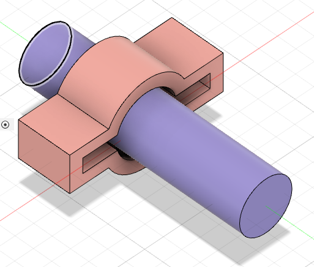 
上記の図のように軸棒を軸穴に入れると軸穴が上下に曲がって軸棒をいい感じにホールドします。

軸が正確な円状ではなくても板が曲がってしっかり保持されます。 
 
かなりいい感じな渋さが比較的簡単に実現できます。が、仕組みを理解してデザインしないといけないです。 
関節の接合部がしなる（曲がる）ゆとりを計算に入れないとうまくいきません。 
また、大きいサイズになるほどデッドスペースが増えていく・しならせるために厚さをあまり太くできないので、保持力不足になる恐れもあります。 
ABSフィラメントの特性（曲げに強い）がないとFDMプリンターでは実現はかなり難しい。光造形ではほぼ不可能。 

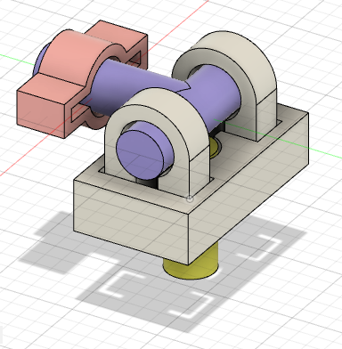 
上記の挟み込み3軸関節は昔設計したもので今見るとあまり良くないです。 
いろいろなバリエーションが考えられますが、僕自身はあまり慣れていないので作った経験はありません。 
 
[ギャレス@gyalles_22](https://twitter.com/gyalles_22)さんの[ワンプレートソルジャー](https://gyalles22.booth.pm/)の関節が挟み込み関節なのでBoothで購入して遊んでみるとわかりやすいです。

### メリット
* 気持ちの良い渋さが実現できる。
* 摩耗による劣化に強い（よく遊べる）
* 関節部分をコンパクトに出来る。
* 普段はじゃまな積層傷があっても無視できる。
* 軸等に高い精度を要求されないので印刷が楽。

### デメリット
* 素材をかなり選ぶ。PLAではほぼ実装不可能。大きさもフィラメントの質にかなり影響受ける
* 曲がる余裕を組み込まないといけないので、デザイン制約がある。
* 保持力があまりない。材質の剛性しだい。
* 大きなサイズが作りにくい。保持力不足になりやすい（小さなものは逆にいい感じになる）
* デザイン設計がかなり難しい。テスト印刷必至。
* 塗装するための表面処理（やすりがけ）と相性が悪い。

***

### 基本的な構造

## ネジ関節
ネジを使った関節はまずねじの事を知らないと駄目です。

### ネジのサイズ
ネジのサイズはM2とかM3とか軸の口径を大雑把にmmで表したものになります。 
ただ、メーカーやなべ・さらとかタッピングネジ等の種類によって微妙に違うので、購入したらネジのサイズの確認が必要です。たいていの場合は誤差範囲なのですが、アマゾンでまとめ買いとかするとシャレにならないくらいサイズ違いがあるときがあるので注意です。 
 
僕は13cmサイズのフィギュアが主なのでM2を多く使っていますが、18cm超えるサイズやボディ重たい・強い渋さが必要な時にはM3を使うこともあります。 
サイズが変わっても緩みやすさはあまりかわらないのですが、タッピングネジの場合はネジの口径が太いほど頑強になり緩みにくくなります。

### ネジの種類
* なべねじ 
ネジの頭がつぶれたドーム状になっているものでまぁ普通のネジです。頭側にもワッシャーをかまして抑え面積を増やすことができます（あまり有効ではない） 
ネジ頭が飛び出すのでデザインによってはそれを隠す必要があります。
* さらねじ 
ネジ頭が円錐形で、ネジをはめた状態が平らになるものです。頭側にはワッシャーが使えないのであまり圧着力はありませんが、デザインは楽になります。 
* ナット 
ナットです。これがないと挟み込めません。デザイン的に非常に邪魔になるので隠したデザインを考えないといけないので面倒です。 
可動部分なのでナットは非常に緩みやすく、使っていた時は２個重ねしてました。抑えるナットとそれが緩まないようにするナットで２個です。 
最終的には「タップ」を使って印刷物に直接ネジ穴を作ってました。ネジ穴の長さをナットより長く設計できるので緩みにくく、デザインも楽になります。
* ワッシャー 
普通はナット側につけてナットによる傷を防ぐものですが、可動関節では印刷物が直接触れ合って摩擦で摩耗しないようにするために挟み込むことがほとんどです。角度によって渋さが変わることを防ぐこともできます。M2用だと直径5mmのものと6mmのものがありサイズや太さがまちまちなことが多いのでデザインする前に使用するものを決めておいたほうが組み立てが楽になります。
* タッピングネジ 
ナットが要らないネジです。木材専用で「木ネジ」と呼ばれるものもあります。
緩みにくい特性があるので関節には最適です。僕はタッピングネジのサラねじをよく使ってます。ただ、元穴の口径を最適化してないとねじ込めなかったり、印刷物を割ってしまったりします。また、ネジ穴をなめやすいので扱いが難しいです。

### ネジ関節の構造
ネジ関節の基本となるコ型ネジ関節の構造の解説です。基本的なネジ関節ですが、ネジ関節の弱点も説明します。
#### コ型ネジ関節
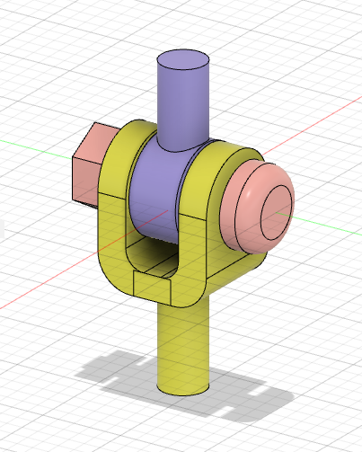 
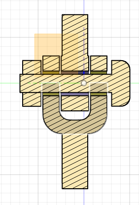 
上記の図のようにコ型の板に可動部分を挟み込んだ構造になります。ネジで左右から圧迫して摩擦でシブさを出しています。 
<b>ポイントはコの形がゆがんで押さえ込むことで、曲がりのゆとりをしっかり作らないと破損する恐れがある事です。</b> 
 
ネジで調整することでちょうど良い渋さにすることが可動ですが、その状態はネジにとっては緩んでいる状態でありナットが非常に動きやすくなってます。そのため、可動部分がネジに触れていると動きに合わせてネジが回転してしまって緩んでしまいます。 
<b>このモデルだと僅か数回動かしただけで緩んで保持できなくなります。</b> 
ワッシャーを挟んだり、ナットをもう1個追加すれば多少は緩みにくくなりますがあまり美しくありません。 

#### 2枚板ネジ関節
2枚の板をネジで単純に挟み込んだ関節です。 
コ型と比べると曲がり余裕を考慮する必要が無いのでかなりコンパクトに出来ます。 
ですが構造上可動するとネジが必ず動くので緩みます。少しでも動かすと緩みます。 
構造が簡単なので使いたいのですが、コ型より緩みやすく使うにはかなりの工夫が必要となります。 
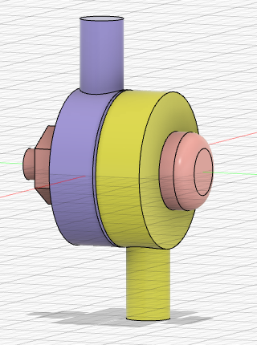 
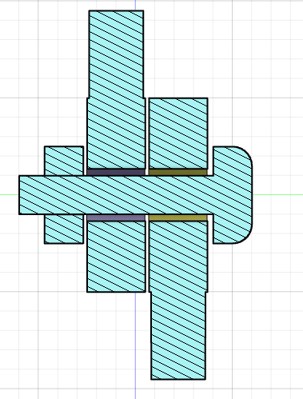 

この例ではナット・なべネジをつかってますが、<b>2枚板ネジ関節は、基本的にさらタッピングねじ以外は使えないと考えて良いです。</b> 
さらネジは特性上軸の中心位置をしっかり固定できるので、回転部分とネジの軸を非接触に出来ます。さらにボス側の長さをしっかりとれば十分な保持力を持ちます。 
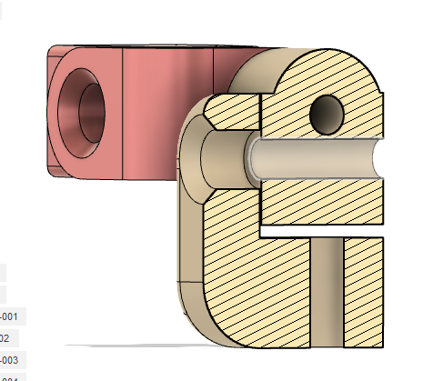 

### 緩まなくする方法
いろいろやって効果的だったのが以下の手段です。

基本的には可動部分を動かした時、ネジとナットが動かい状態であれば緩むことはありません。 

* <b>保持力を強くする</b> 
一番効果的です。ナットを2個にする。保持力が強い<b>タッピングねじ</b>を使う等です。 
タッピングねじは長くなればかなり強い保持力になります。 
M3サイズの10mmのネジだとほぼ緩むことが無いです。まぁねじ込むのもかなり力がいるので組み立てに苦労しますが。 
 
最初はナットを使ってましたが、最終的には<b>タッピングねじ（さらネジ）</b>のみ使うようになりました。これ以外無いって感じです。
瞬間接着剤でナットを固定するという野蛮な手段もあります。

* <b>可動部分とネジが触れない構造にする</b> 
ネジと可動部分が接触していない構造なら緩むことは無くなりますが、実際そんな構造はなかなか簡単小さくデザインできません。具体的にはコ型で回転軸にネジを置かず別の場所にネジを仕込めばいいです。 
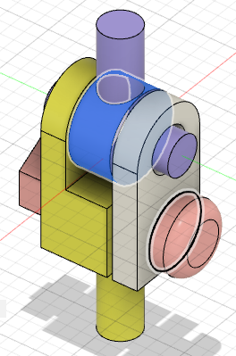 

* ナットを使う場合はナットを固定して動かなくなる構造にしておく。 
ナットを固定しておけば少しは緩みは減ります。ただナットに負けて本体が破損することが多いです。 
ナットを使わないで「タップ」を使って本体にネジ穴を作る方法もあります。幅をナットより長く出来るので保持力が少し上がります。ただなめてしまいがちです。タップでネジ穴を作ってさらにナットを締めることも有効です。
* <b>ワッシャーを挟む</b> 
まぁ緩み対策としては気休めですが、摩耗による緩み防止としては有効です。ワッシャー2枚重ねで間にグリース塗っておくとなかなか良い感触になります。

### ネジ関節参考
これは僕がよく設計するネジ関節の例です。 
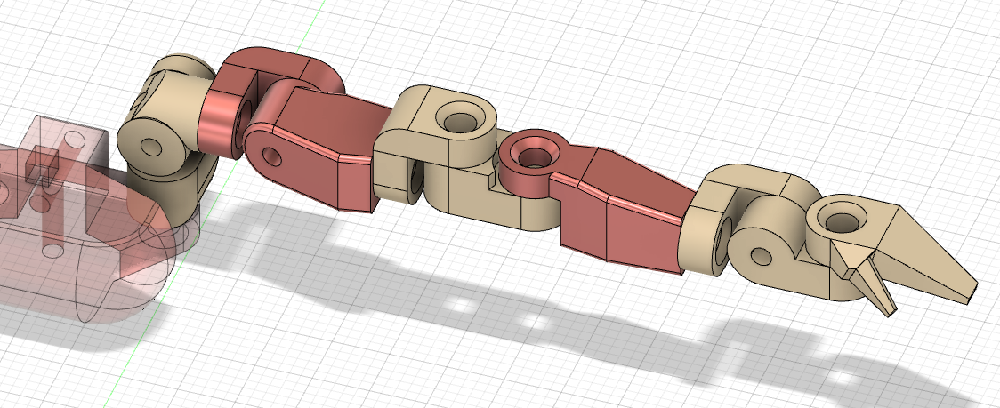 

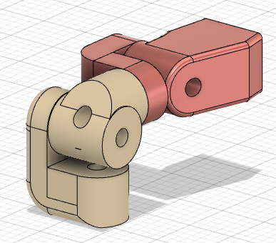 
肩の部分は3軸関節を2個組み合わせています。 
M2の8mm<b>タッピングねじ（皿ネジ）</b>を想定しています。 板を2mmと6mm以上としてネジで固定する構造です。間にはワッシャーを必ず挟みます。 
タッピングでボスとなる板は6mm以上でなおかつ穴は向こう側まで貫通させてあり、保持力が弱かったら10mmのネジも使えるようにしてあります。ネジが後締め出来ない箇所は最初から10mmのネジを使ってます。 
<b>さらネジ</b>は穴の形状的に旨く作れば軸が可動部に触れないので緩みづらく、ボス側の長さを十分にとればかなり強い保持力を持ちます。 
 
<b>でも、やっぱりネジ関節は結構緩みます。</b> 
基本的に好きなポーズにしたら堅く締めて固定するという遊び方が基本ですね。 
 

### ネジ関節のメリット

* 設計がしやすい。
* 組み立てが簡単。
* 組み立て後の渋さ調整がしやすい

### ネジ関節のデメリット
* <b>緩む（致命的）</b>
* 構造が複雑になりやすく、大きくなりやすい。
* デザインの自由度があまりない
* ネジ穴をなめてしまいがち
* ネジとかワッシャーに以外とコストがかかる。
* ネジを隠すデザインが大変
***

## ボールジョイント関節
僕は3Dプリンタを買って最初に挑戦したのがボールジョイント関節です。 
でも技術が無くて旨く印刷出来なくて諦めてネジ関節に移行しました。ネジ関節は印刷技術・組み立て技術が無くても設計通り組み立て可能なので重宝していましたが、やはり緩みの問題が我慢できず方法を模索してました 
ネジが緩むのは回転軸とネジが同じなので別にすれば良いのですが、複雑な構造になりがちなネジ関節がさらに複雑になるので諦めました。挟み込み関節に挑戦しましたが、特性上塗装と相性が悪くなおかつ設計に難しさに苦労しました。 
で、最初に諦めたボールジョイントに挑戦しました。 

### ボールジョイントの利点
ZYZ回転軸の交点が一致しているので、気持ちの良い可動が出来る。

### はめ込みボールジョイント関節
よくあるパチントはめ込む関節です。 
海外のロボットの3Dデータを見ると採用されている奴です。 
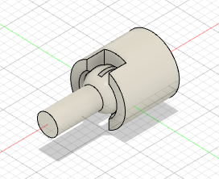 
はめ込めてな尚且つシブさを出すためには、ボールにスリットを入れたりすることが必要になります。 
テスト印刷でちょうど良いサイズを見つけなければいけないのですが、その日の印刷環境によってかなり変わるので苦労します。で、決めて実際にデザインに落とし込んでいったものが使えなくてがっかりしました。 
 
結局ゆるめに作ってダイソーで売ってる「水性ニス」か木工用ボンドを関節内に流し込んでちょうど良い渋さにするのが最善でした。 
それでもはめ込む時にかなりの確率でジョイントのメス側が割れるトラブルに悩まされました。 
 
家庭用3Dプリンタのフィラメント材質の限界を感じました。旨く印刷出来れば凄く良いのですが、強度も精度もたりません。テスト後にDMMに関節だけ印刷を頼もうとか考えました。
 
はめ込みがうまく出来れば渋さもちょうど良く回転3軸の中心を交差できるのでボールジョイントには魅力がありました。で、挟み込む部分は別パーツにしてネジ止めすれば良いと思いついて「挟み込みボールジョイント」に挑戦することにしました。

### はめ込みボールジョイント関節のメリット

* 構造が簡単。シンプルに出来るのでデザインの自由度が高い
* 部品数を減らせる。

### はめ込みボールジョイント関節のデメリット

* <b>壊れやすい</b>
* 摩耗に弱い。
* 組み立て後の渋さの調整がしにくい

### 挟み込みボールジョイント関節
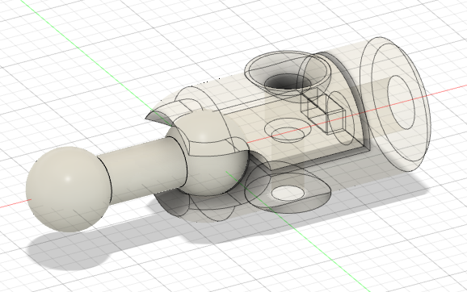 
最初に作ったのがこのテスト関節で予想以上に旨くいきました。 
いっぱいテスト印刷したのですが、破損はほぼ無く好調です。テスト印刷したものを組み合わせてロボットも出来ました。
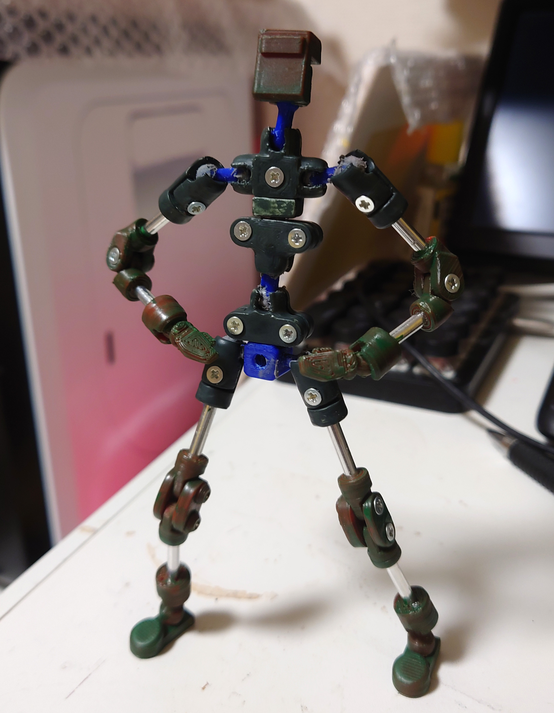 

以下のリンクにテストで使用したFusion360データがあります。
* はめ込みボールジョイント関節テストのFusion360データ 
[BallJoint2nd v10.f3d](https://github.com/bryful/3DP/blob/master/3DP_DATA/%E3%81%AF%E3%82%81%E8%BE%BC%E3%81%BF%E3%82%B8%E3%83%A7%E3%82%A4%E3%83%B3%E3%83%88/BallJoint2nd%20v10.f3d)

* ジョイントロボ [JointRobo](https://github.com/bryful/3DP/tree/master/3DP_ROBO/JointRobo)

## 挟み込みボールジョイント関節のメリット

* 渋さの調整が容易
* 分解が容易

### 挟み込みボールジョイント関節のデメリット

* 部品数が多くなりがち
* 関節が大きくなりがち

#### ボールジョイントのボールサイズ
ボールジョイントとボールの大きさは僕は5mmと6mmで固定しています。棒軸の口径は3mmで決めているので単純にその2倍という数値で決めました。 
 
あと所有しているリューターのビットで5mmと6mmの球形ビットを持っていたのでそれに合わせてもいます。 
リューターで削ればかなり均一のになり簡単に精度を上げられます。 
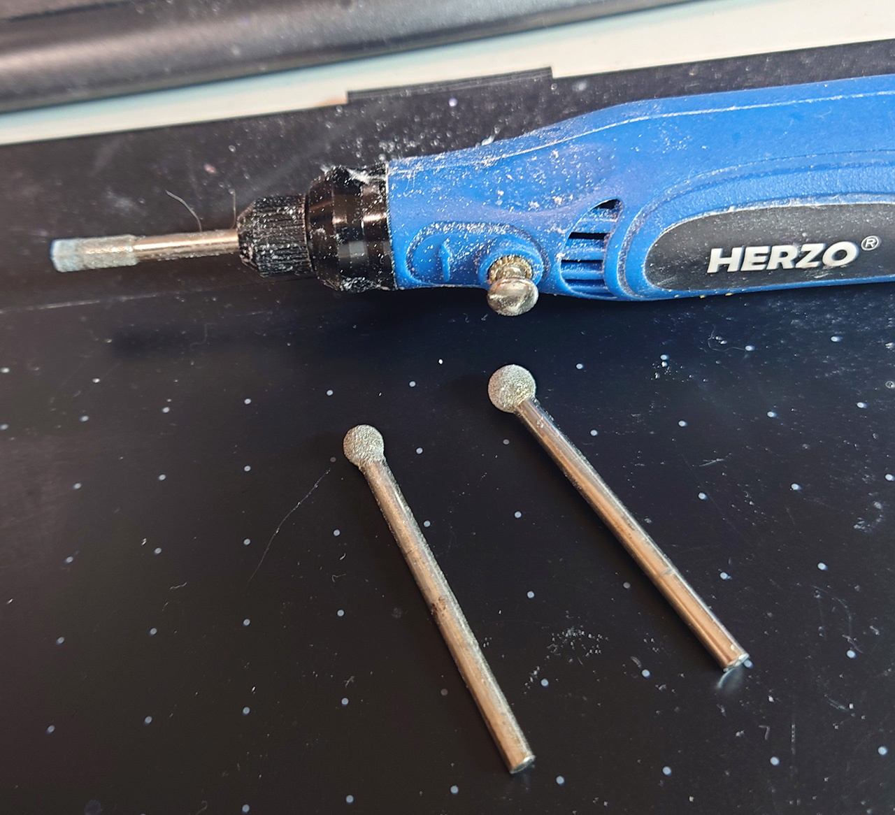 
僕は印刷設定が苦手なので後処理で精度が上げられるので重宝しています。 
テクニックとしてクレオスの水性ラッカー「アクリジョン」のクリアをボール穴に筆で集めに塗って乾いたらリューターで削ると良い具合になります。 

#### ボールジョイントのボールサイズ、デザイン時
5mm/6mmとボールサイズを決めましたが印刷時に太るので実際は4.8mm/5.8mmと少し減らしています。穴の方も5.2mm/5.8mmと大きくしています。 
0.2mmx2x2で0.8mmの隙間を空けていますが、これでもまだ0.5mm位足りなくてですが、挟み込み型の特徴でそれくらいは誤差の範囲で組み立てには問題ないです。
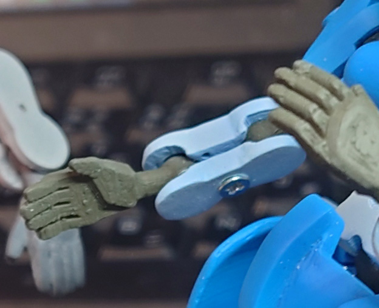 
このロボットの腕のはデザイン時では0.4mmの隙間を空けていていますが、実際は1mm位あいてます。でも特に問題なく組み立て・可動させてます。

#### ボールジョイントの印刷
ボール部分の精度がまず第一なので旨く印刷する方法を考えました。 
 
ラフト付きでもなしでもですがボール部分がベットに近いと必ず球の接触面が崩壊します。 
まぁ距離を離せば良いので自前でサポートつけて対処します。 
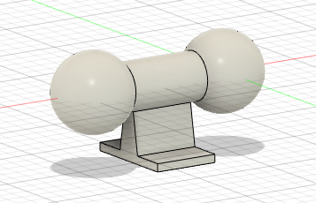 
これをFlashPrintで自動サポートつけて印刷すれば接触面の崩壊は防げます。
サポートは印刷が終わったらニッパーで切り離します。 
このようにすればラフトなしで他のパーツと一緒に印刷出来るので手間いらずです。
 
最初は穴あき5mmのビーズを購入してそれをボールにしようと思ってましたが、以上の方法で精度が問題なかったので印刷したものを使用してます。 

#### ボールジョイントの挟み込み時のゆがみ
挟み込みの抑えとしてネジを採用していますがサイズを小さくするために1個で押さえてます。 
ただ、どうしても押さえが1カ所だと傾いてしまうのでそれに対処する必要があります。 
本当は2カ所以上ネジで押さえれば良いのですがデザイン的に駄目な事が多いです。 
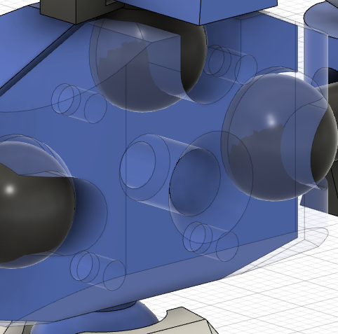 
そのような時は1.2mmの穴を開けておき1mmの真鍮棒を差し込んであげます。これで傾きはかなり改善されます。 
まぁ、見た目分からなければ傾いた状態でも問題はありません。慣れてきたらボールサイズを旨くヤスリで調整して傾かないようにすることも可能です。

***

まだ追加を書く予定です。

***

