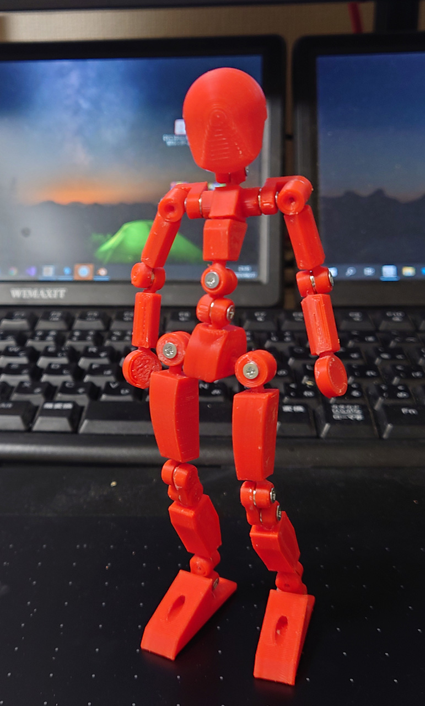
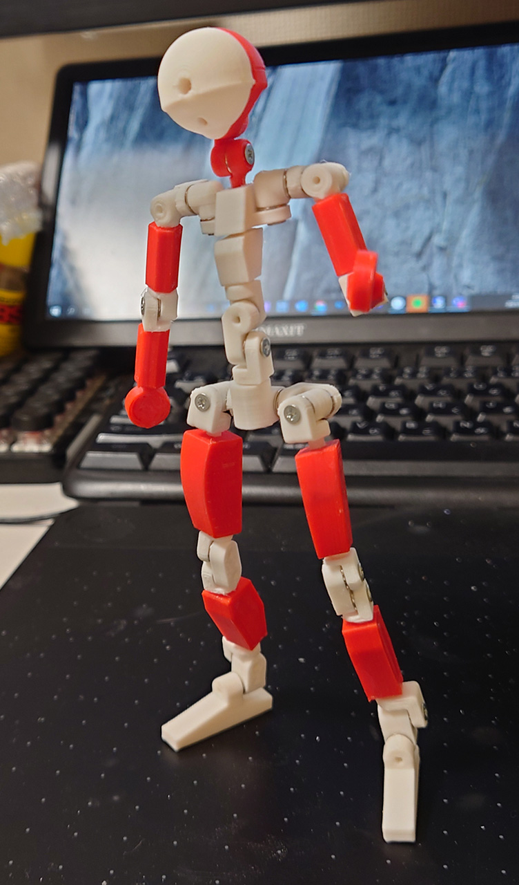

# 関節素体

M2タッピングねじを使った関節にテスト用に作成。

 

いろいろ不都合あった場所を修正して印刷。白い部分が修正箇所。

 

# 反省
M2x6mmはすぐなめてしまうので、M2_8mm以上出来ればM2_10mmを使うこと。 
棒のはめ込み関節はやはり無理があるのでなるべく使わない。すぐに外せて楽だけど。

# Authors

bry-ful(Hiroshi Furuhashi)
twitter:[bryful](https://twitter.com/bryful)
bryful@gmail.com

