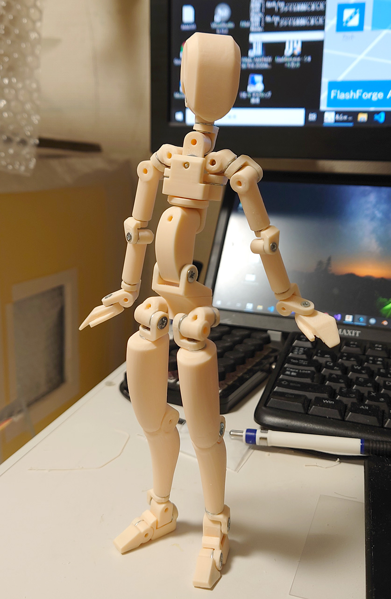
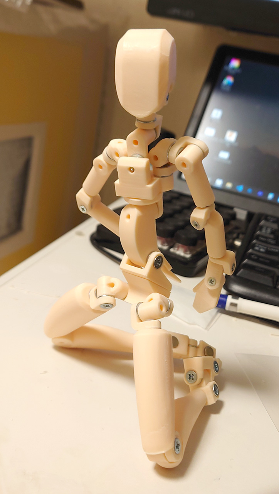
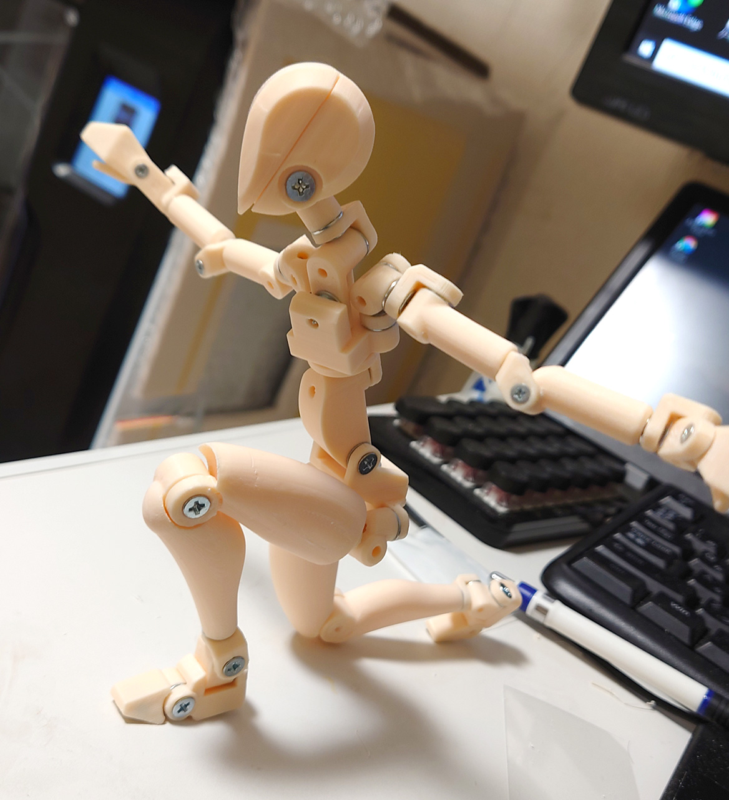
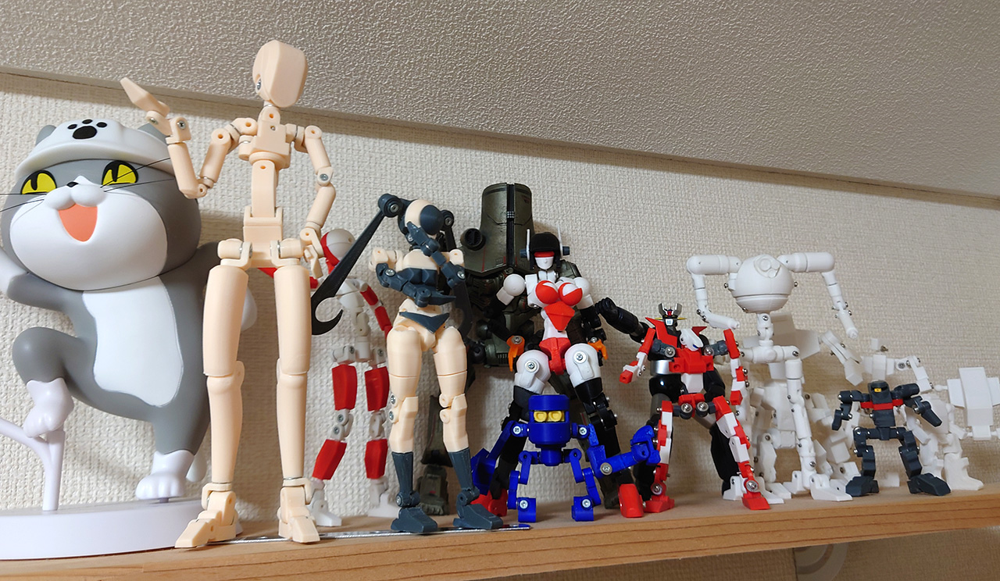
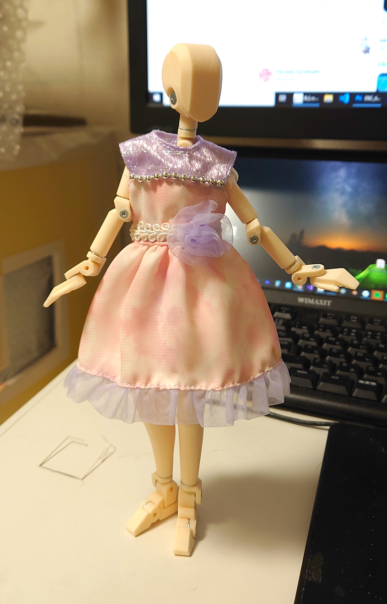
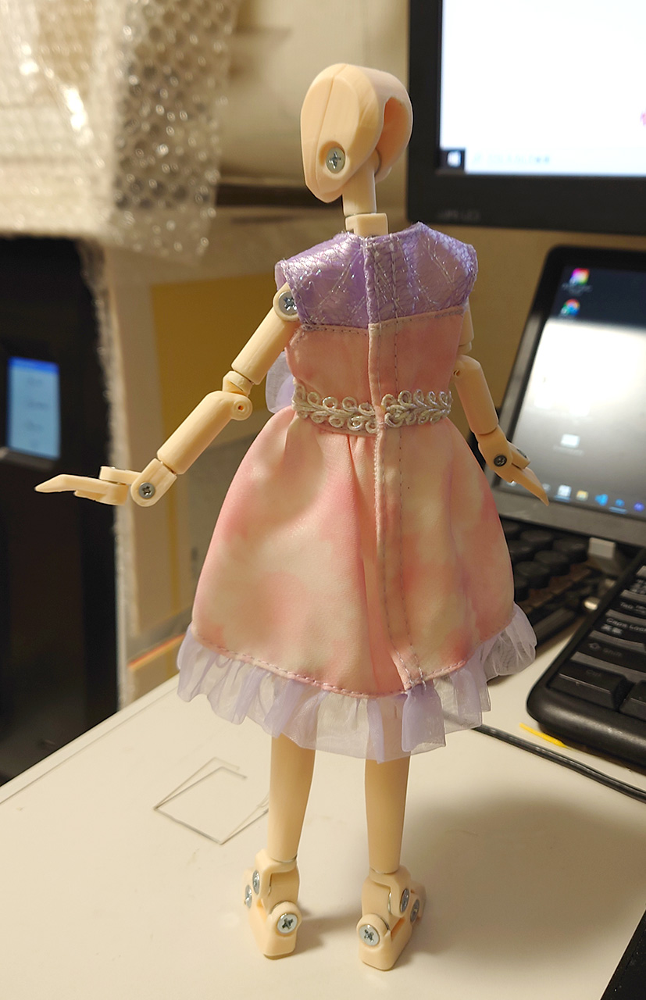

# 関節素体 22cm

リカちゃんサイズの関節素体です。 
 

[クレイマンさんの素体](https://twitter.com/claymanlabo/status/1412926392560353280)見たら無性に同じものを作りたくなって、ちょうど作っていた22cm用の関節素体を途中か思いっきりリスペクトしてみました。 
根性なくなって足は元のものをそのまま使ってるので、なんかアンバランスです。 
 

 
 
 

 
クリアランスをミスってあまり稼働しないところが結構あります。 
足に磁石いれたので、自宅の机には凄いよく立ちます。 
 

 
 

22cmサイズはちょうどリカちゃんと同じサイズなので服をそのまま着せることができます。 
最初はそれが目的でもっと人間のシルエットをかなり残し他デザインにする予定が、関節メインになって円柱と立方体だけで作るつもりでしたが、根性なくて足だけ名残として残しました。まぁ服着せる気だったので関係ないかなと。
奥さんに腕が残念とか言われたので腕だけデザインし直すかもです。 

# メモ　M3タッピングねじ

ボス側の穴は2.6mmで作ったが、M3_8mmだと小さすぎた。今後<b>2.8mm</b>にする。 
反対の穴は3.4mmだが、積層方向によってネジが入らなくなるときがあった。
<b>3.5mm</b>にする。 

M3_8mmはたまに凄く緩まるときがある。その時はM3_10mmに変更した。デザイン的にM3_10mmを使うとうにした方がいい。 

ワッシャーの厚みを0.2mmとしていたが0.5mmにした方がいい。

# Authors

bry-ful(Hiroshi Furuhashi)
twitter:[bryful](https://twitter.com/bryful)
bryful@gmail.com

