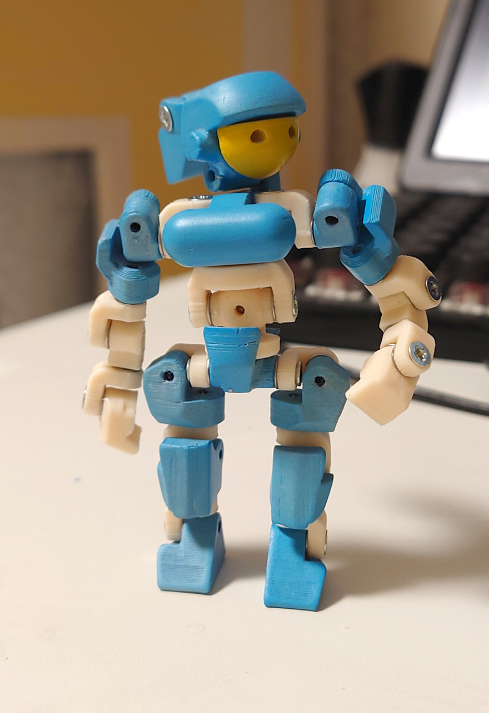
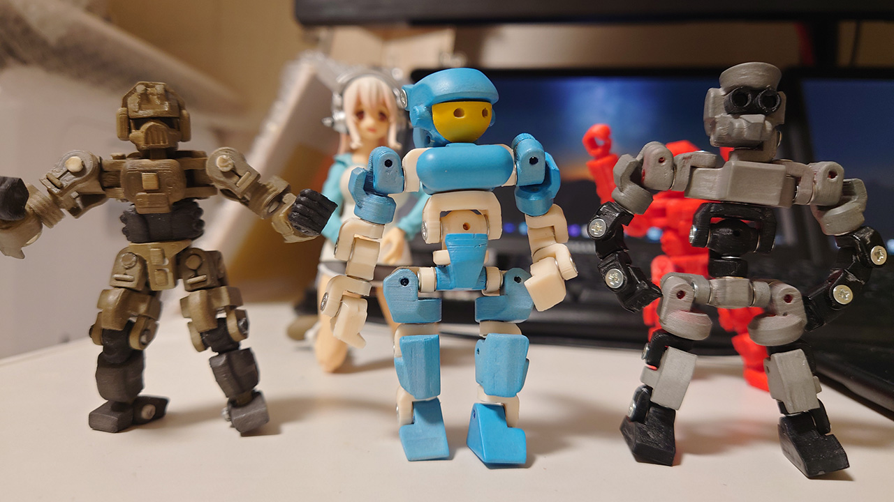

# 70mm版「ひとみちゃん」
2021/0807 
 
ひとみちゃんをワンプレートソルシャーサイズにダウンサイジングしてみました。 
小さすぎて表面処理（ヤスリがけ）がほとんど出来ません。塗装後にひび割れ剥がれが凄いです。 
設計し直そうにも対処が思いつきません。

 

 

# Authors

bry-ful(Hiroshi Furuhashi)
twitter:[bryful](https://twitter.com/bryful)
bryful@gmail.com

