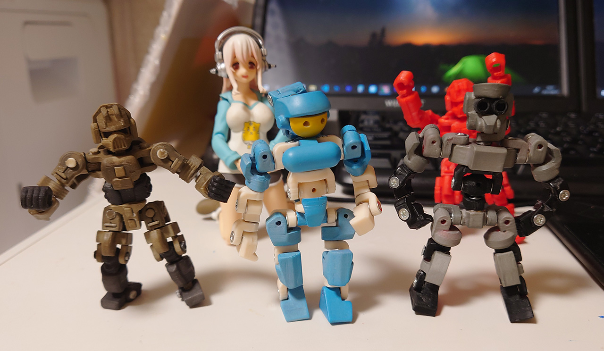

# 70mm Robo

2021/08/07 
関節の微調整を行ったものを印刷しました。塗装もしてみました。
 
関節の干渉はほぼ想定通りになったが、ネジの緩みの問題が発生。 
このサイズだとM2_6mmを想定して設計したけど、組み立て時に問題起きてM2
_8mmに変更できるところは変更した。 
 

 

2021/08/04 
関節の微調整。まだ印刷はしていない。 

2021/08/03 
 
gyalles_22さんの[ワンプレートソルジャー](https://gyalles22.booth.pm/)がツボにはまったので、自分でも同じようなものを作ってみた。
 
ワンプレートならぬツープレートソルジャー^^; 
 
 
 

夏休みに色を塗ろう！ 

M2_6mmの皿ネジを多用しましたが、やっぱり6mmだと緩みが酷いです。何か改善できる方法ないかな？M2_10mmだとほぼ緩みはなくなるけどデザインにかなり制約がでるからなぁ。

# Authors

bry-ful(Hiroshi Furuhashi)
twitter:[bryful](https://twitter.com/bryful)
bryful@gmail.com

