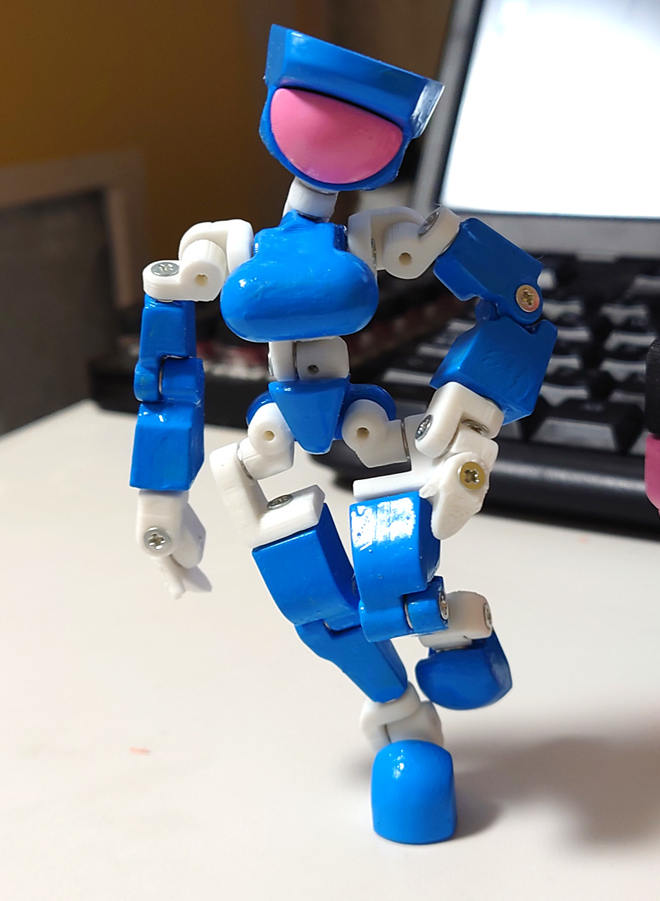
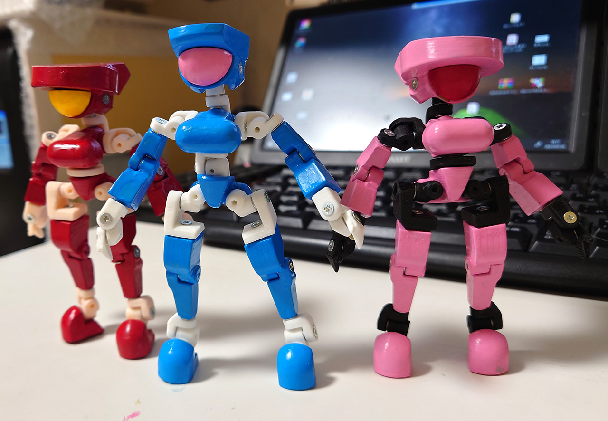
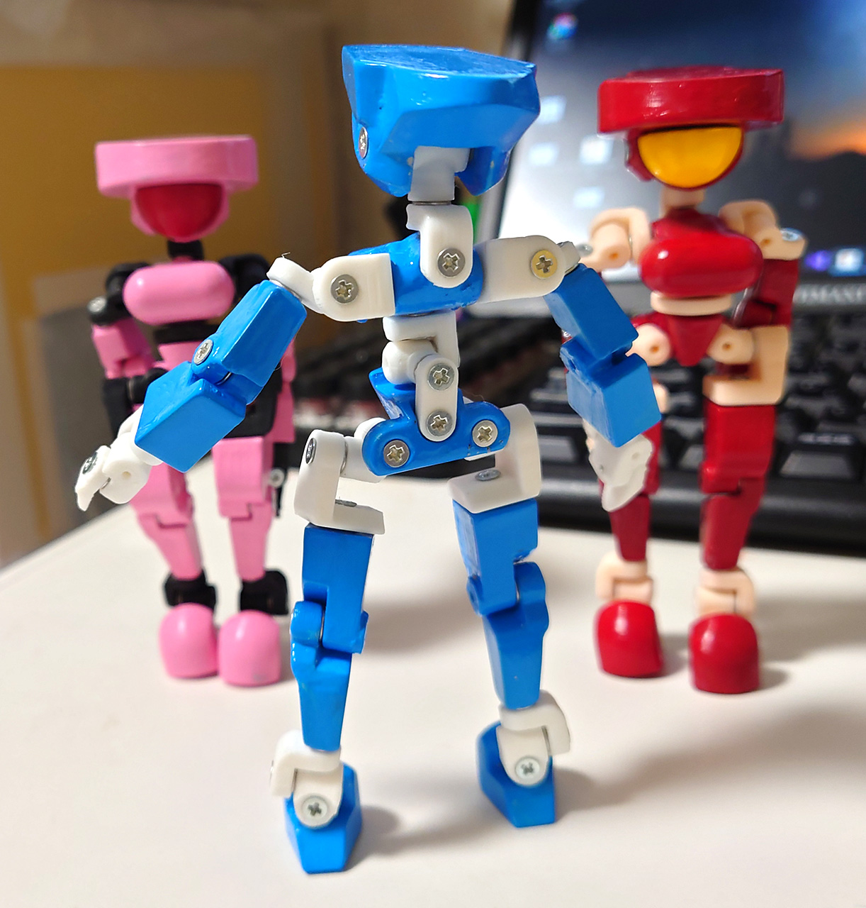
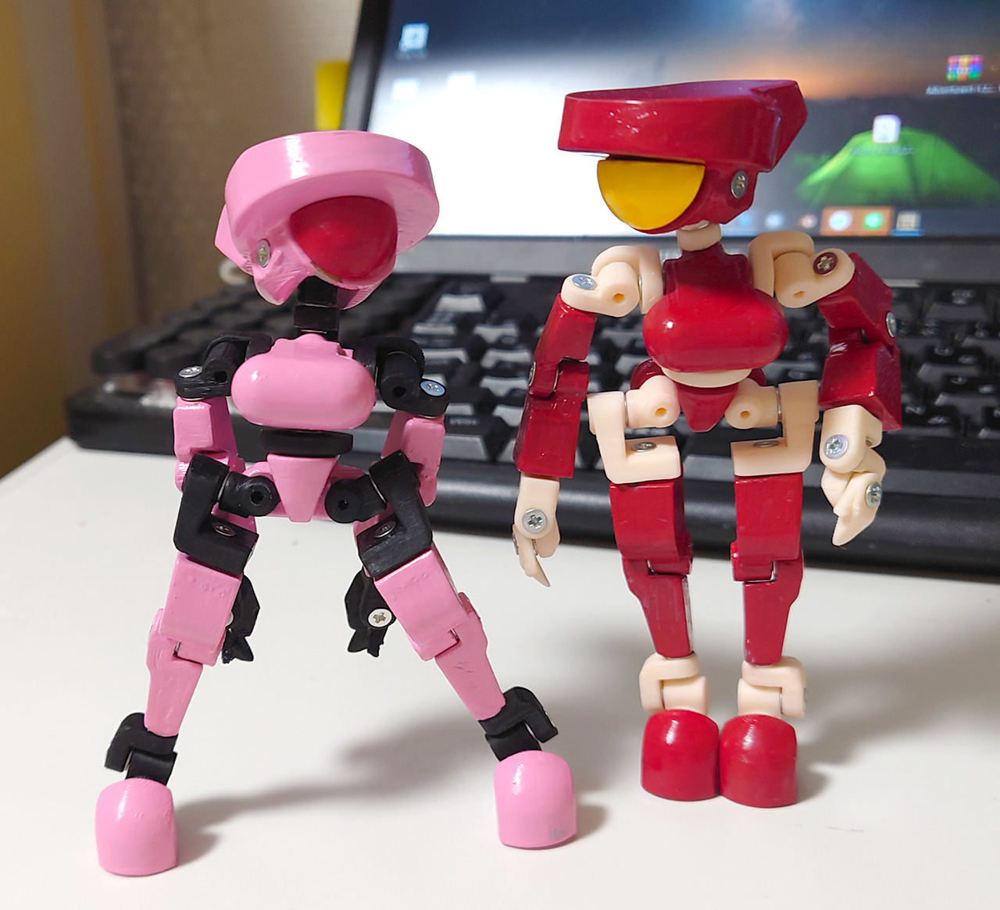
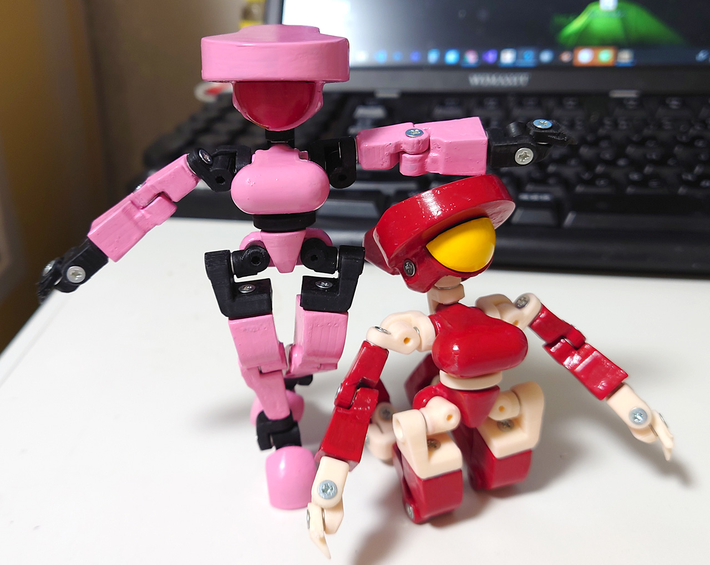
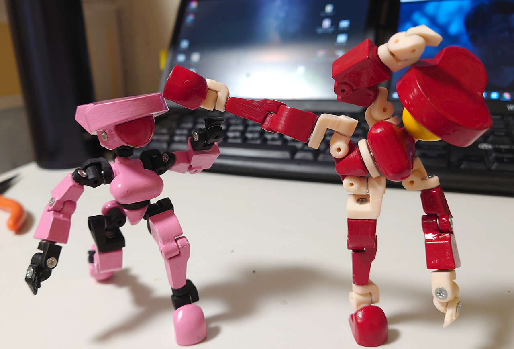
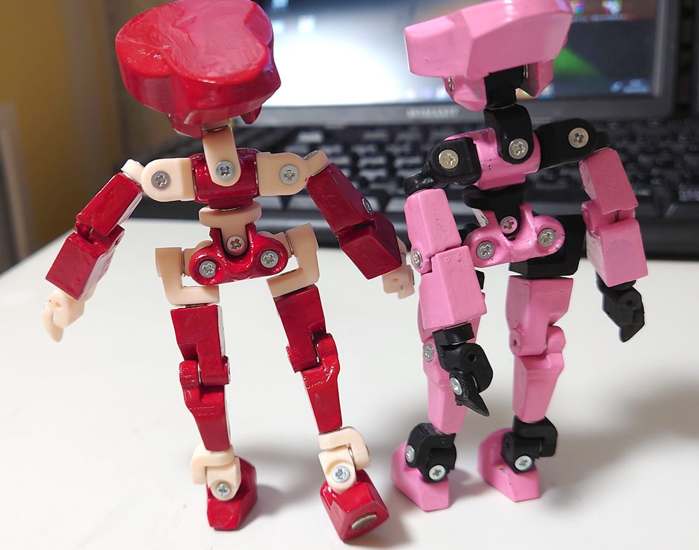

# BigEye ひとみちゃん
2021/07/24 
「ひとみちゃん」の関節の微調整、腰に３軸関節を仕込んだバージョンを作りました。 
 
全高を抑えるために頭を小さくしたらちょっとバランス悪くなったけどまぁいいか。
 
 
 
Mr.Colorのラッカー使ってるけど、サフ噴いても樹脂割れが起きて修復が大変でした。
何かいい対処方法ないか調べよう。 
水性ラッカー使えばいいけど水性ラッカーいろいろ不信感あるからなぁ。苦労して塗ったらしばらくすると溶けて流れたってトラウマあるから。最近の奴は大丈夫なのかな？ 
どちらにしろ筆塗りが大変でエアブラシを考えたい。エアブラシで薄塗りがABSの樹脂割れ対策の最初かな？
 
 

2021/07/22 

一つ目ロボット「ひとみちゃん」を印刷しました。
初めて塗装に挑戦してみたけど、大変でもうやりたくなくなった。ムラとかハガレが至る所にでててエアブラシが欲しくなりました。
塗装の実験やりながらなので最終的に2体出来てしまいました。
 
塗装の実験ばかりで関節のクリアランスがかなり怪しいです。
やっぱり肩の関節はもう1軸欲しいです。腰も。
 
 
 

# Authors

bry-ful(Hiroshi Furuhashi)
twitter:[bryful](https://twitter.com/bryful)
bryful@gmail.com

