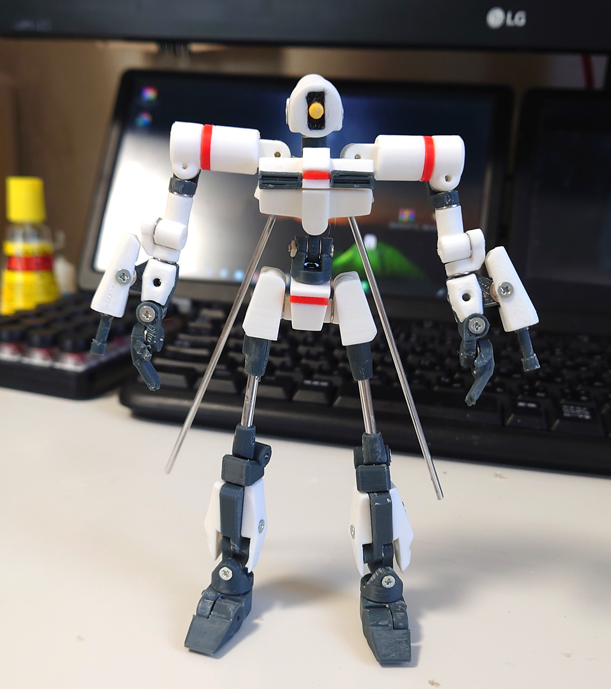
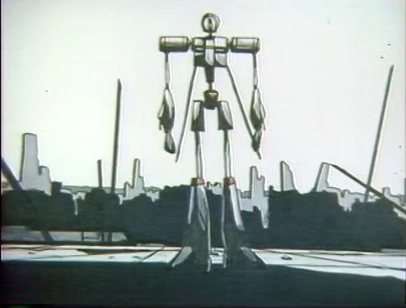
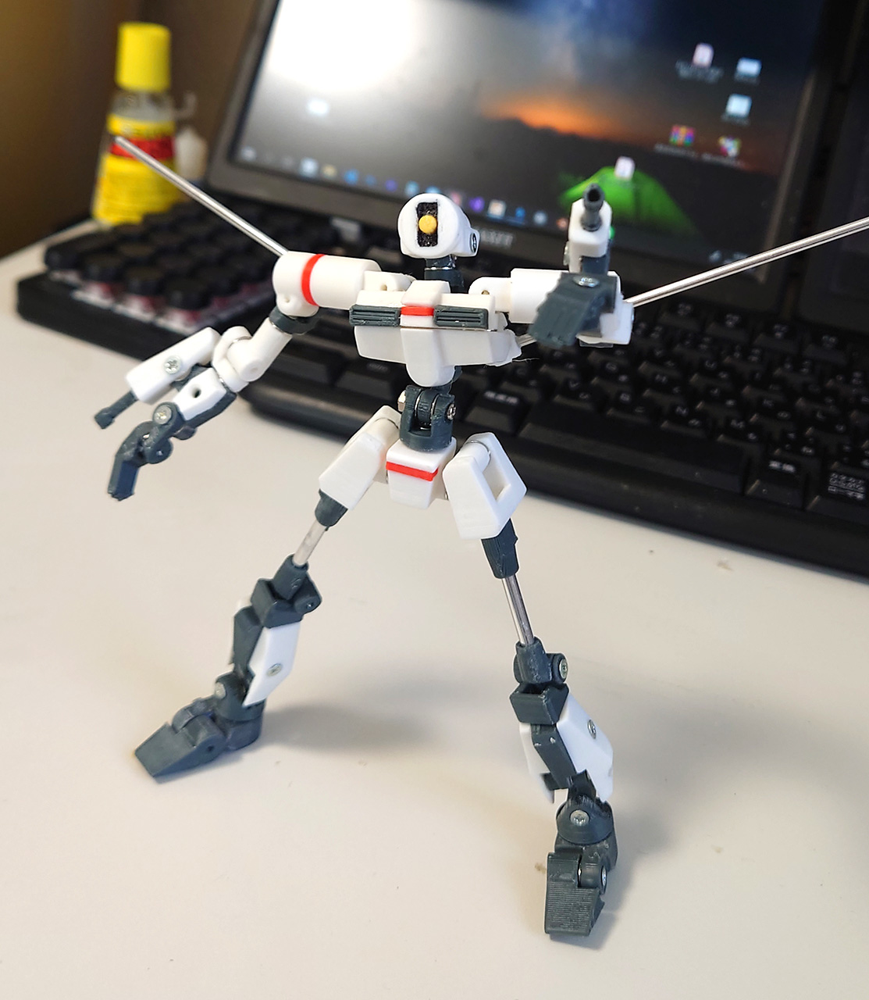
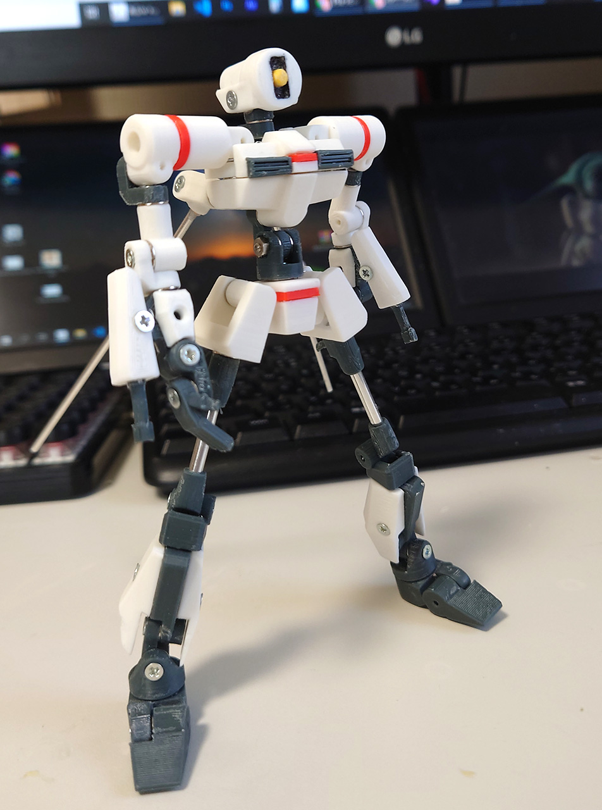

# 「おともだちロボ」
2021/07/17 

大昔に作った自主制作アニメに登場するロボットを印刷したもの。
 

オリジナルが細い・関節ないってものだったのでかなりデザインが変わりました。
 

ふとももと背中の棒は3mm/2mmのアルミ棒を使ったらなかなかいい感じになりました。 
 
腰の関節はいろいろトラブルあったので、今は設計し直して変えています（写真がないけど） 
 
ダークフレーの部分の積層痕をヤスリで削ったら白くなって直せなくなってます。気にするなら塗装しないと駄目ですね。

# Authors

bry-ful(Hiroshi Furuhashi)
twitter:[bryful](https://twitter.com/bryful)
bryful@gmail.com

