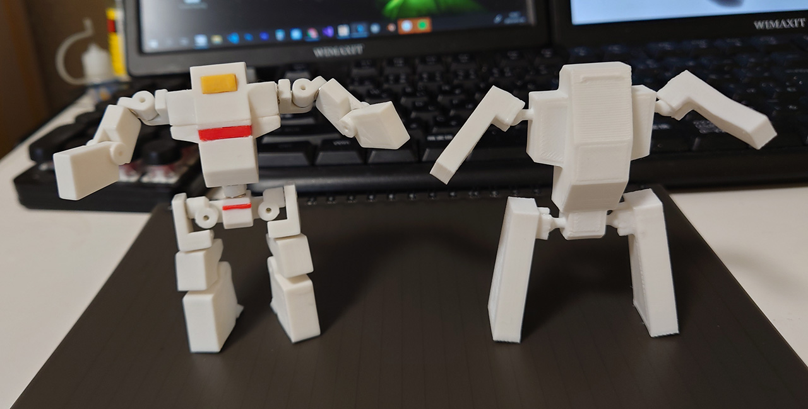
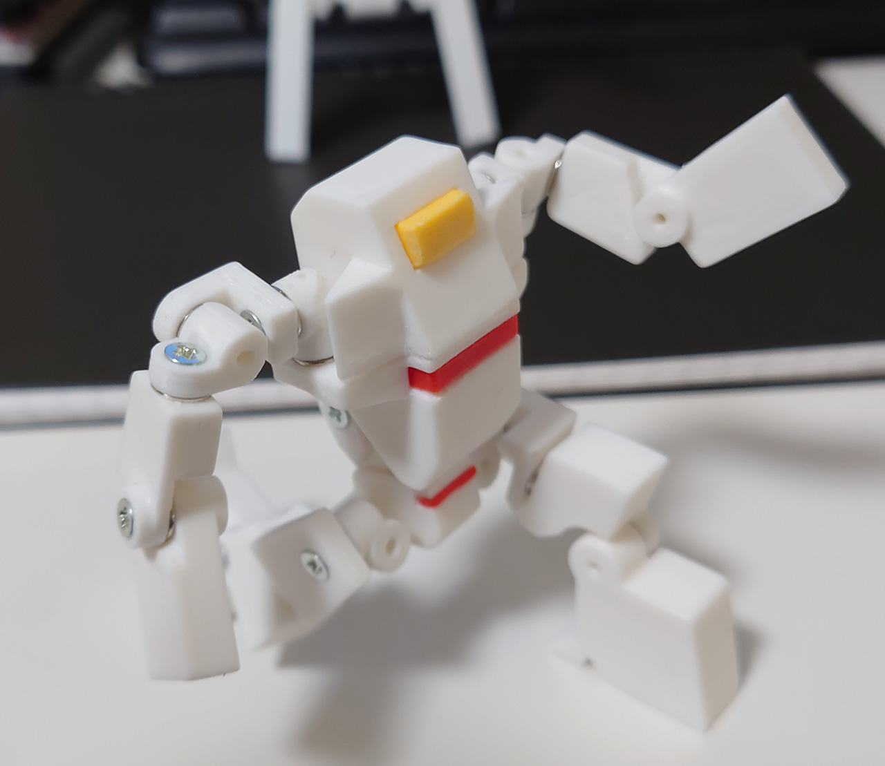
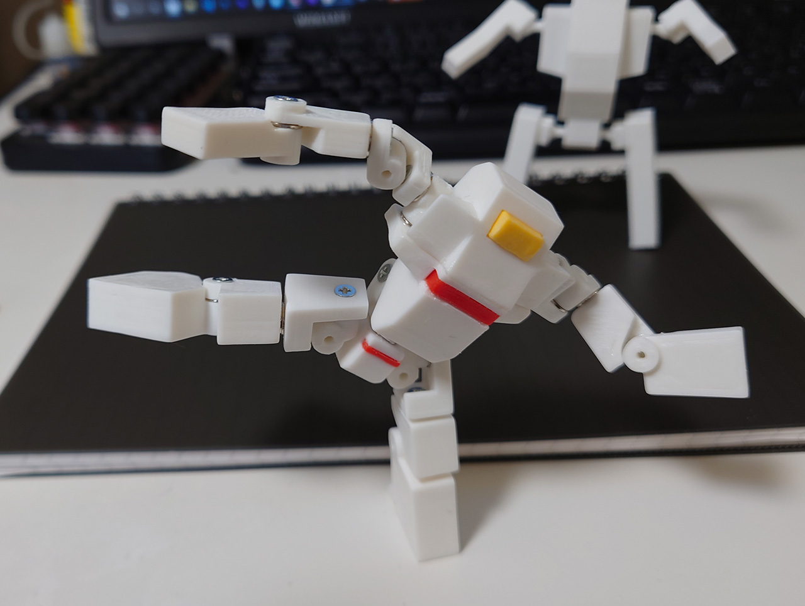
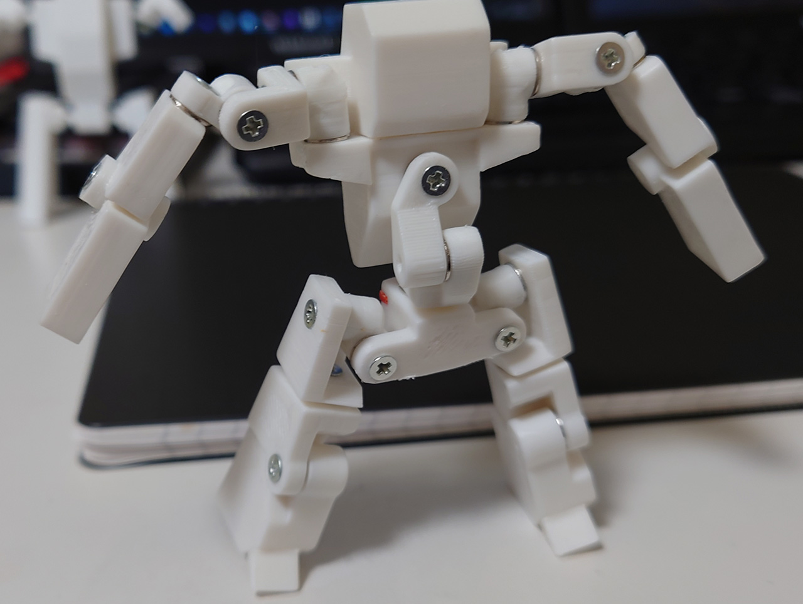

# ロボ君 1体目 type2
2021/07/18 

ロボ君1体目をバージョンアップさせたモノ。 
 

設計に3時間、印刷6時間。元は設計1時間、印刷2時間だからだいぶボリュームアップしてます。なるべく元のシルエットを崩さないように苦労しました。

* 腕と足の付け根を球体関節からネジ止めの3軸関節に変更。
* 手と足の関節を増やした。
* 足の裏にマグネット追加

 
 
 

# Authors

bry-ful(Hiroshi Furuhashi)
twitter:[bryful](https://twitter.com/bryful)
bryful@gmail.com

