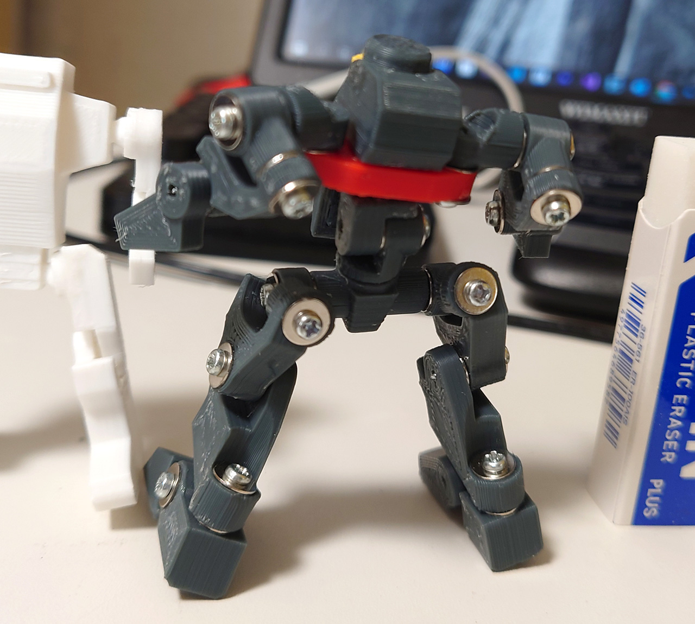

# ロボ君  2体目 Type2

ネジ関節になれてきたので2体目をネジ関節で再デザインしたもの。でも、イメージがガラッと変わってしまった。

流石にこのサイズでは3軸関節とか組み込めなかったので簡易タイプ。

# Authors

bry-ful(Hiroshi Furuhashi)
twitter:[bryful](https://twitter.com/bryful)
bryful@gmail.com

