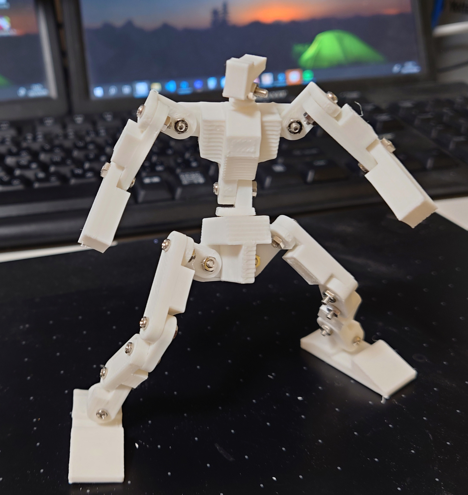

# ロボ君 3体目

2021/05/04 

球体関節を諦めてネジ締めによる関節のテスト用ロボ。 
ちょっと動かすとナットが緩んで困りもの。 
デザイン的にナットの体積の処理が面倒でだんだん諦めてきました。

# Authors

bry-ful(Hiroshi Furuhashi)
twitter:[bryful](https://twitter.com/bryful)
bryful@gmail.com

