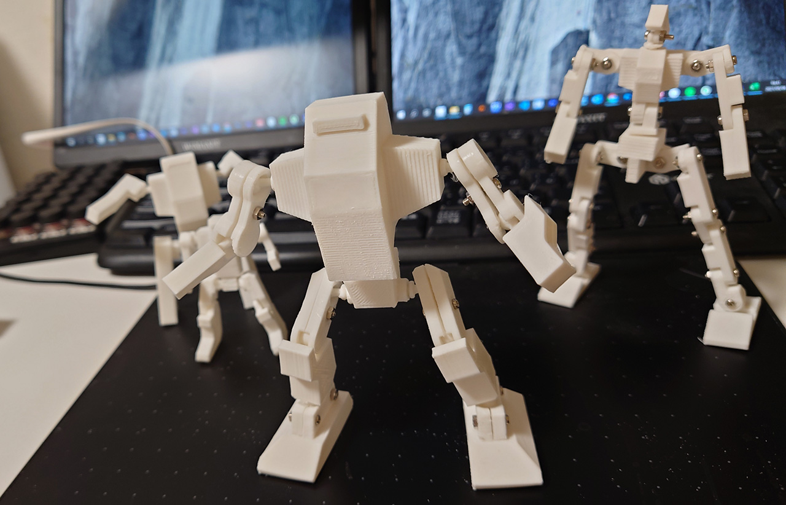

# ロボ君 4体目
球体関節をネジで固定すればいいんじゃないかと作ったロボ君。 
関節の出来はかなり良くかなり満足。 
ただ、可動軸がいろいろ制限あってあまり動かない。クリアランスを間違えると隙間が空いてみっともないと。さらに違う方法を考えることに。

# Authors

bry-ful(Hiroshi Furuhashi)
twitter:[bryful](https://twitter.com/bryful)
bryful@gmail.com

