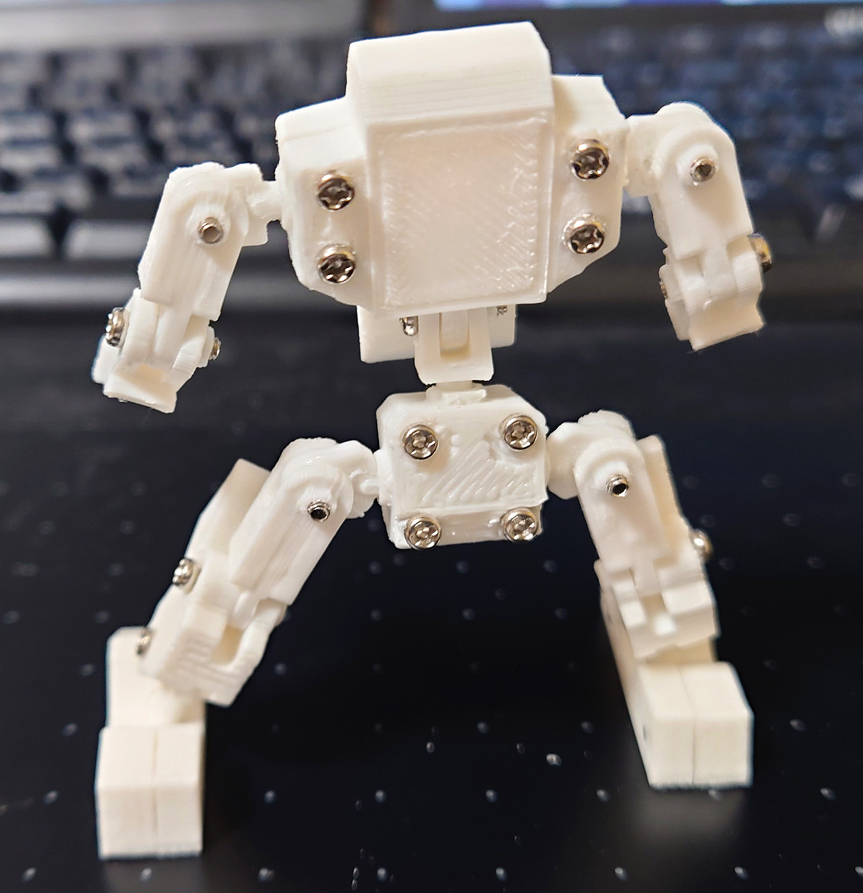
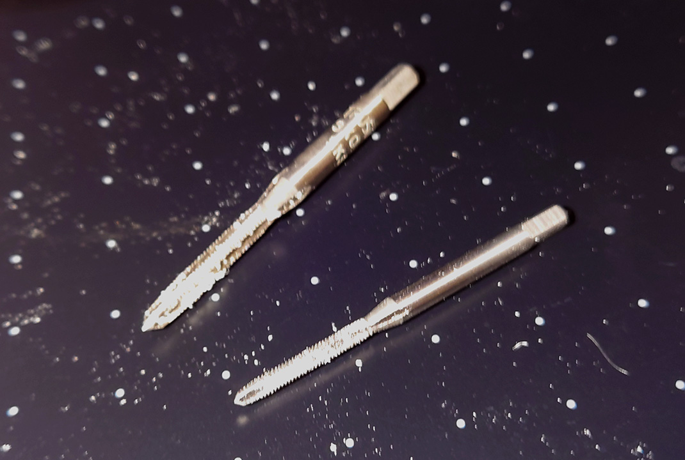

# ロボ君 5体目

ネジ関節を使ったロボ君5体目。 
故膿対策をいろいろ組み込んだもの。かなり満足。
でも、ナット幅がある程度ないとやはり緩むことがわかりました。

一番の対処は、タップをつかってプラ自体をねじ切りしてナット代わりにしたこと。ナット場ないので必ず2枚の板で挟み込み用にしたこと。

# Authors

bry-ful(Hiroshi Furuhashi)
twitter:[bryful](https://twitter.com/bryful)
bryful@gmail.com

