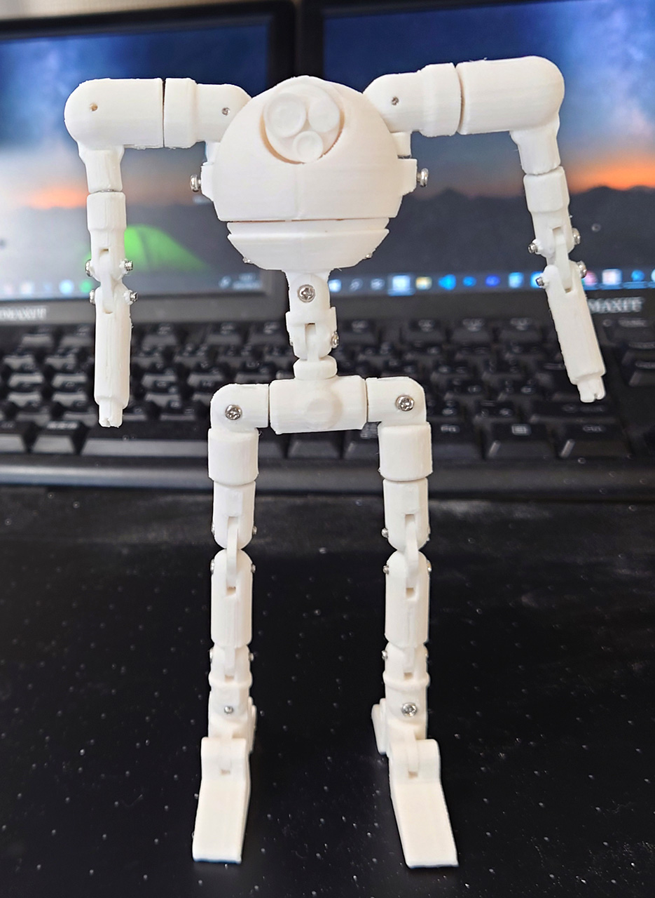
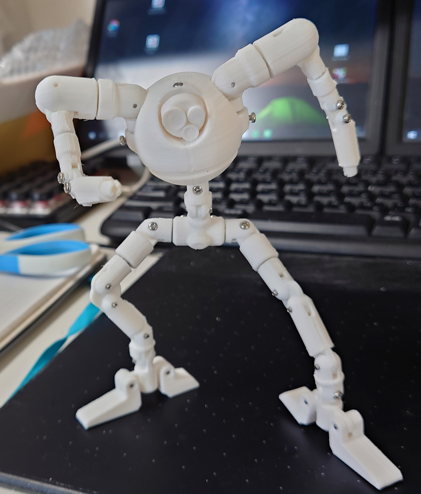
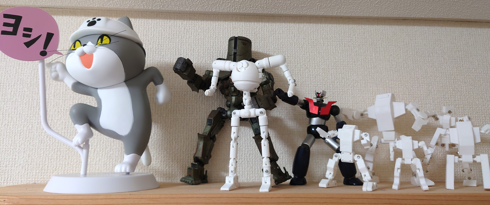

# ロボ君 6体目

2021/05/23 

ネジ関節になれてきたので作ったロボ君6体目 
学生時代の自主制作アニメに使ったロボットを元にデザイン。まぁ宇宙戦争の火星人がモデルです。 
見えないけどはめ込み関節部は3mmのアルミ棒でかなり精度高いです。アルミ棒切るのが一番つらかった。 
デザイン優先だったけど、今までの中では一番可動範囲が広いです。何気に最大サイズ。

# Authors

bry-ful(Hiroshi Furuhashi)
twitter:[bryful](https://twitter.com/bryful)
bryful@gmail.com

