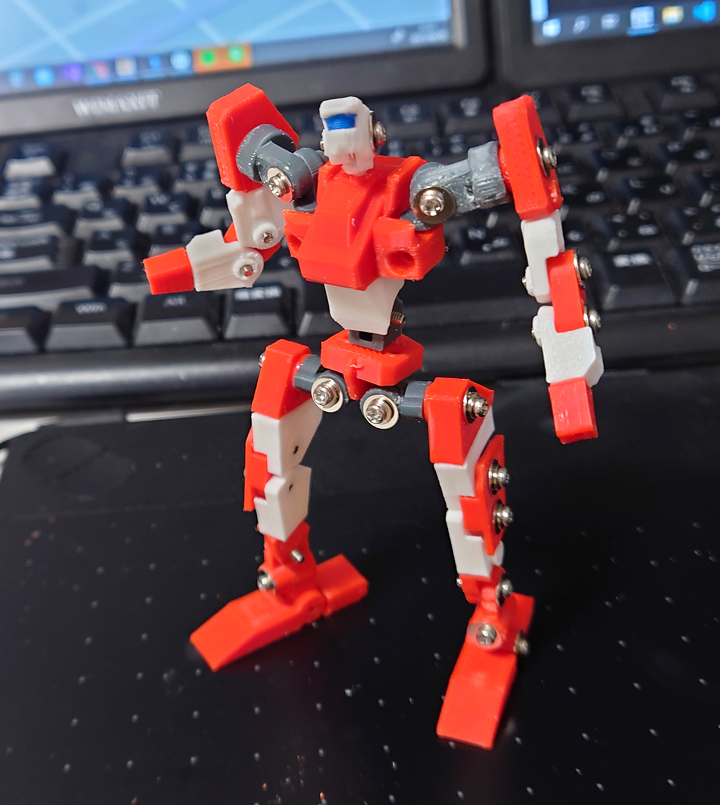
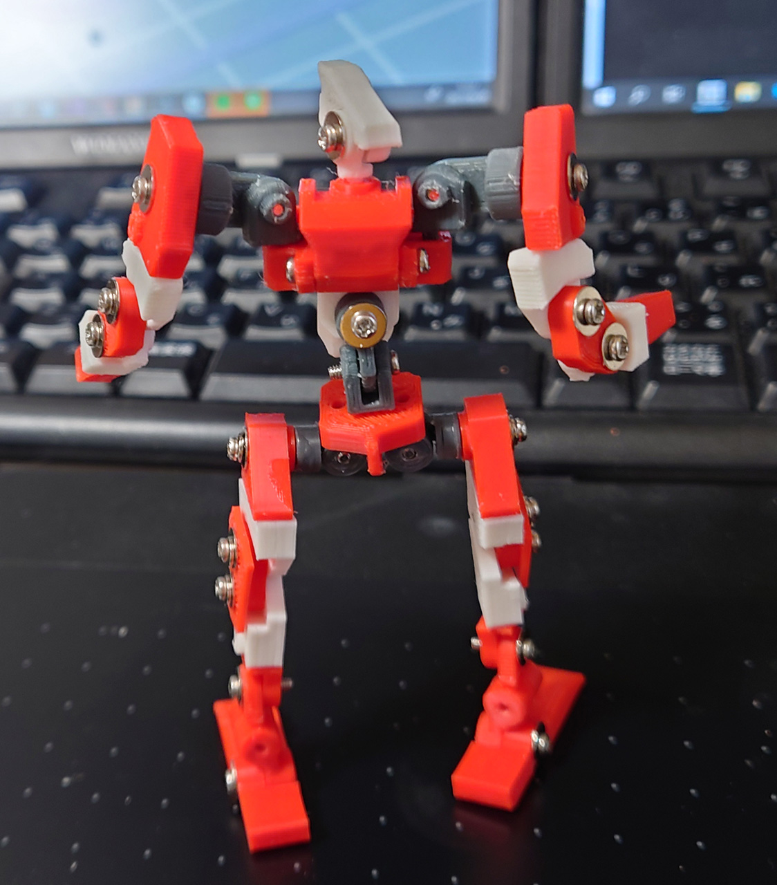
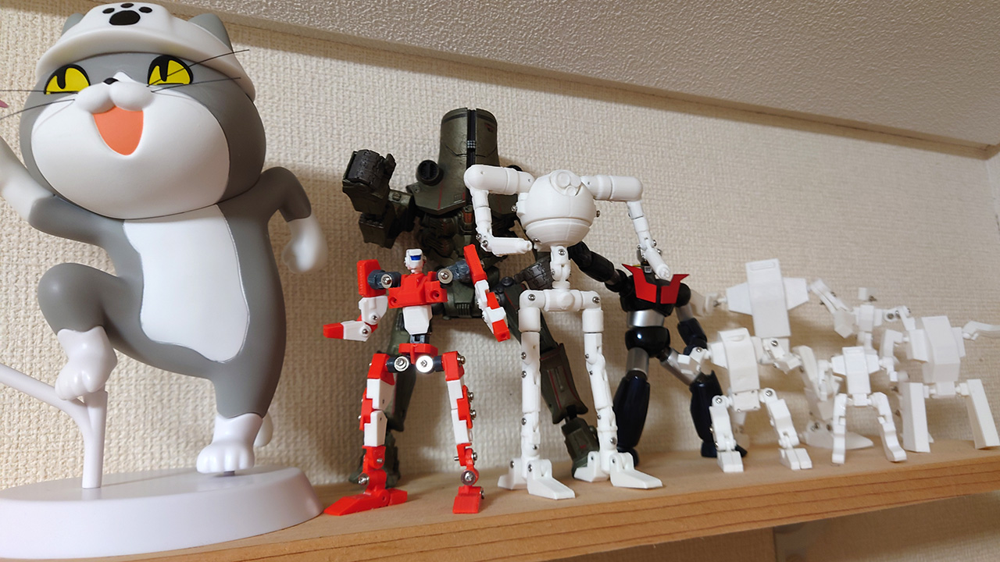

# ロボ君 7体目

2021/06/05 

3Dプリンタになれてきたので、普通のロボット作りたくて作ったロボ君7体目。 
フィラメントを買ったので色つきロボになった。

* 普通のデザイン。頭がある、人型。
* 全高10cm以内
* 可動域はそれなりでもいい。デザイン優先。

として作ったが、肩幅広すぎでがに股。関節を簡略化したら緩みが酷くて動かせないとちょっと反省点多い。 
色を複数にすると見栄えがするから今後多用することに。
 ｓ

# Authors

bry-ful(Hiroshi Furuhashi)
twitter:[bryful](https://twitter.com/bryful)
bryful@gmail.com

