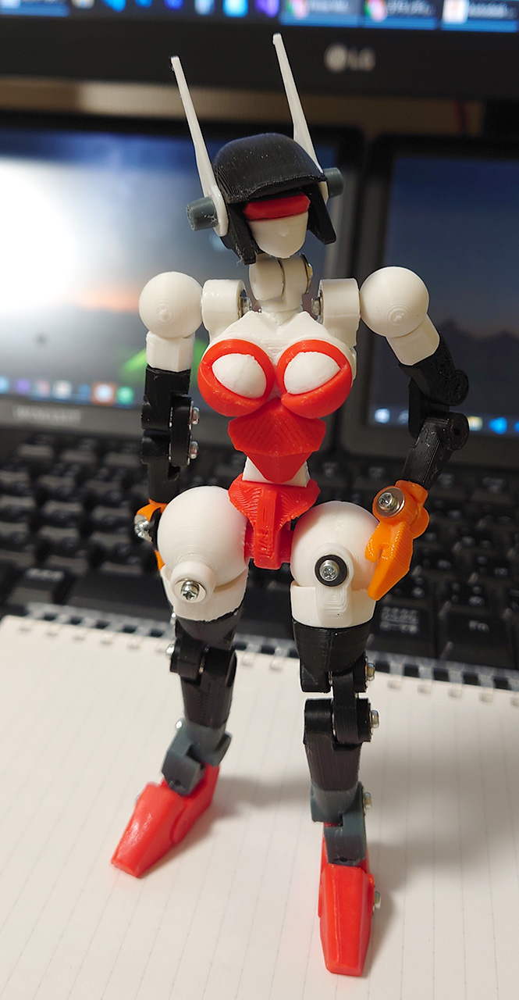
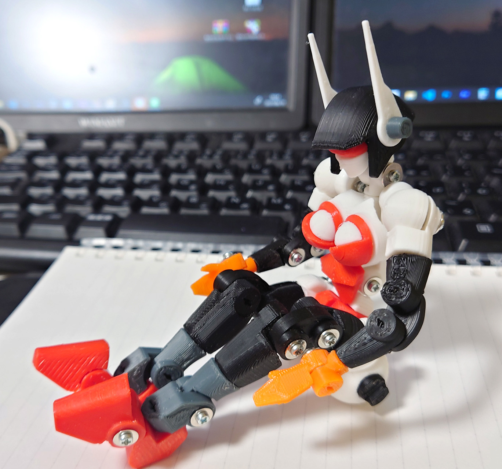

# ロボ君  8体目

2021/06/19 

ロボ君といってるが女性アンドロイド型。 
関節が丸い昔ながらのロボットを作るつもりが、関節が丸いと女っぽいから思い切って女性型にしてみた。 
 
あと、タッピングねじを使った最初のロボ。タッピングねじが予想以上に保持力が高くて、以後全部タッピングねじに。 
この頃は鍋ネジが主体。タッピングねじがかなり良かったので、これを作った後ロボ君2体目をタッピングねじで再デザインしました。

可動もなかなか良かった。デザイン優先したけど人型に近づくほど可動域が増えると実感。

# Authors

bry-ful(Hiroshi Furuhashi)
twitter:[bryful](https://twitter.com/bryful)
bryful@gmail.com

