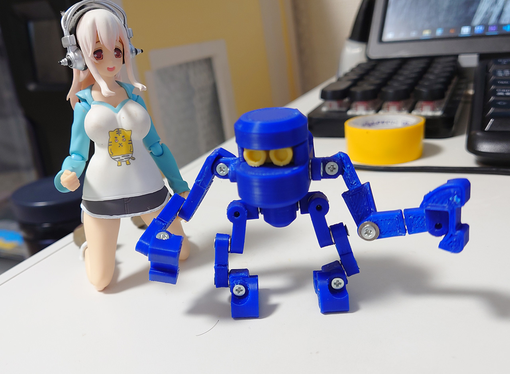
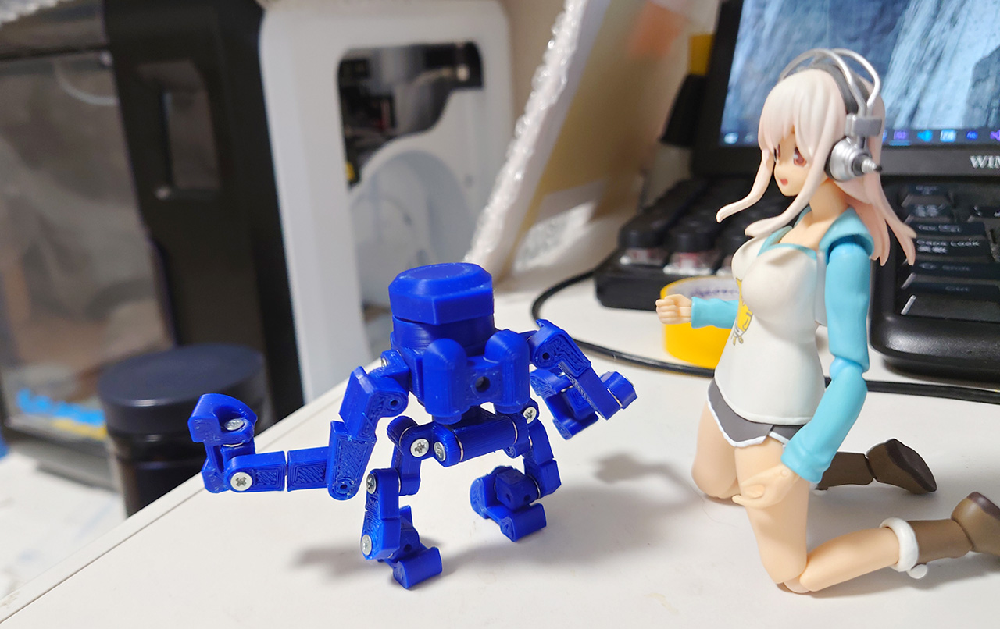
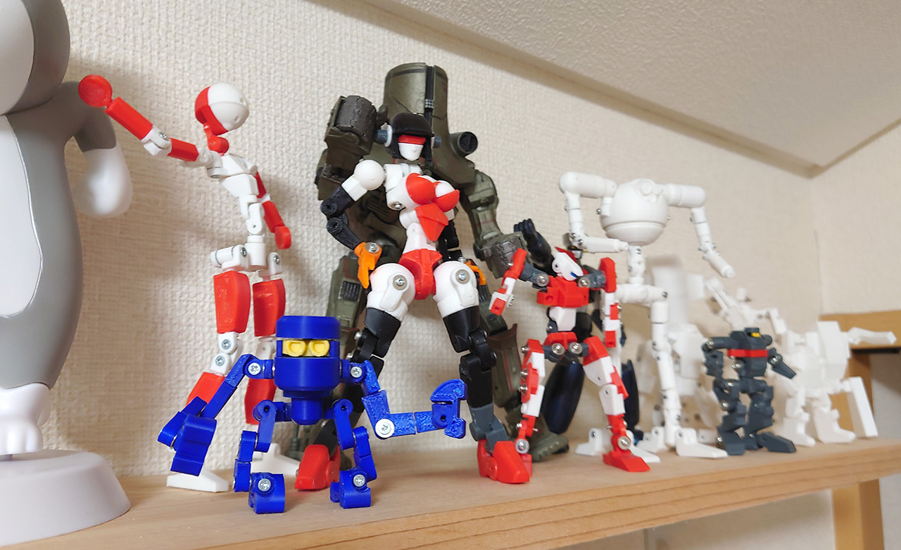

# ロボ君 9体目

2021/07/02 

人型に飽きたので作ったロボ君9体目。 

一応火星探索用高機動ロボって設定で<b>FinderMonkey</b>って名前も考えてました。写真は立たせているけど、実際は4本足で歩きます。手と足のパーツは同じデザイン。サイズは60cm位で、横に置いてあるそに子と同じスケール。 
まぁ、デカいモデルは大変だったから最小サイズで動く奴。自立できるか心配だったので、手を足代わりにつかえるようにとか考えて作ったもの。 

 
小さくてコンセプトモデル的なやつは作ってて面白かった。 

本当フィラメントのダークグリーン買うつもりだったのでそれを想定してたけど、僕の注文ミスでブルーが来て印刷時にあれ？ってなった。

# Authors

bry-ful(Hiroshi Furuhashi)
twitter:[bryful](https://twitter.com/bryful)
bryful@gmail.com

