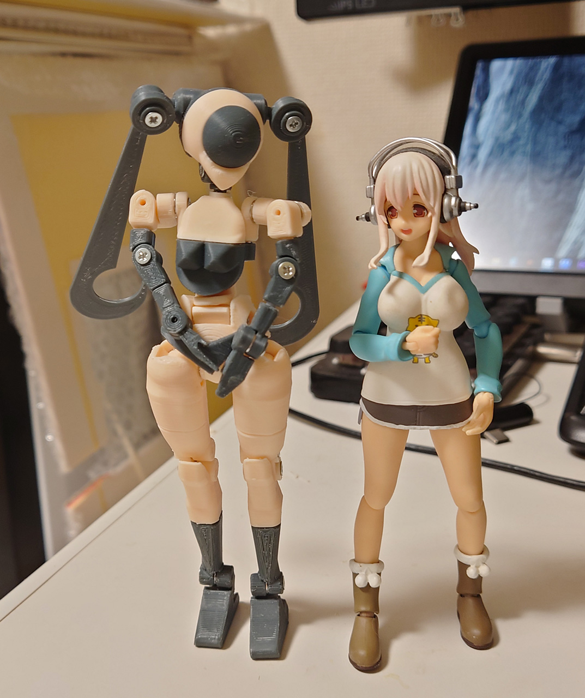
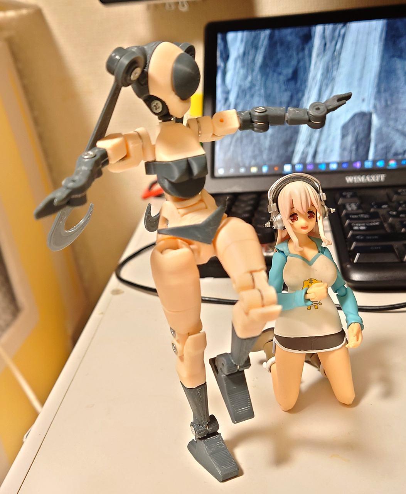
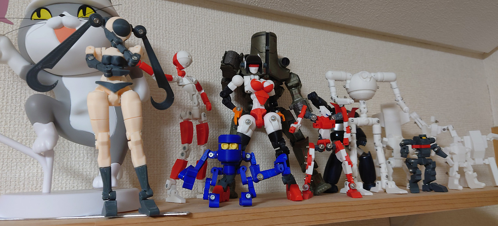

# ロボ君 10体目

FlashForgeのドールカラーsisterを買ったので作ったロボ君10体目。 

ドールカラーきっとカーキっぽい色だと思い注文したけど、実際に印刷したら本当に肌色でびっくり。モビルスーツっぽいものを考えていたけど、これも気が変わって女性型アンドロイドに。一つ目なのはMSデザインの名残。パンツ型パーツは没にした頭アンテナをそのまま使った。足とかかなり角張ってるのも。 

印刷し終わって肌色部分多過ぎなのが気になったけどそのままにした。

MSデザイン時は肩パッドとか上半身が凄い重そうなデザインだったので足にマグネットを入れて自立させようと予定してた。印刷し終わった後足に穴が開いてて思い出して、マグネット入れた。 
バランスとらなくても片足立ちができてマグネット凄いとか思った。

大幅なデザイン変更したので足の付け根のクリアランスとるの忘れてて、可動が全く出来なかったので、ルーターで削ってはめ込みました。

# Authors

bry-ful(Hiroshi Furuhashi)
twitter:[bryful](https://twitter.com/bryful)
bryful@gmail.com

