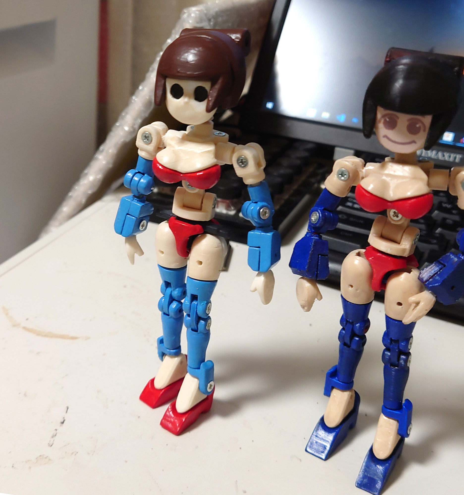
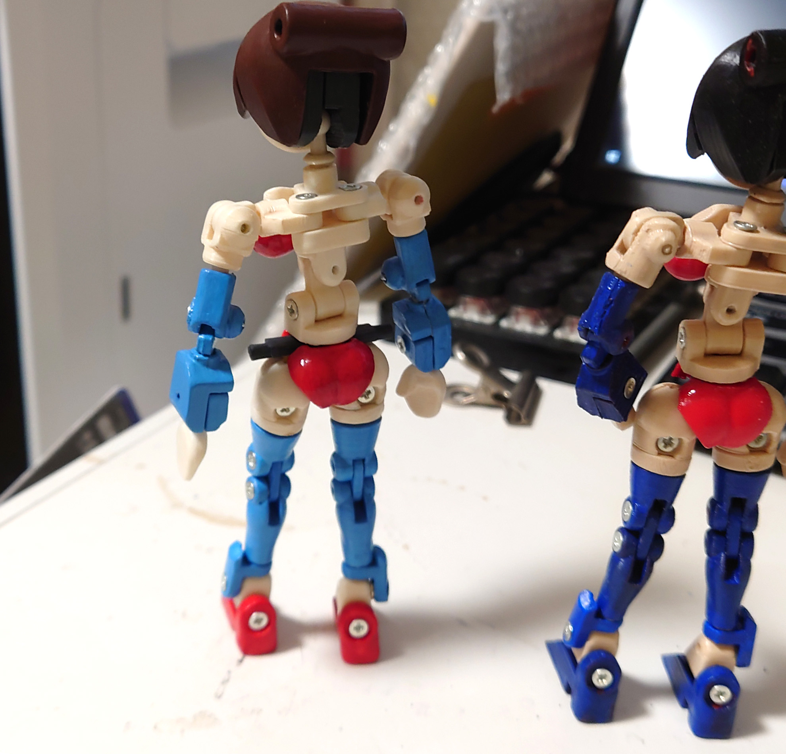
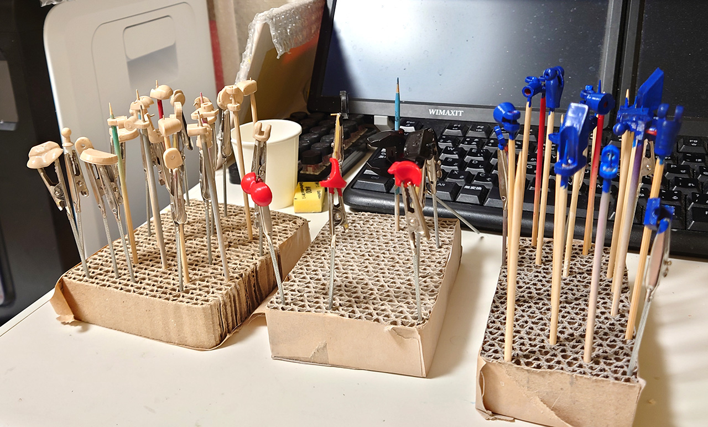
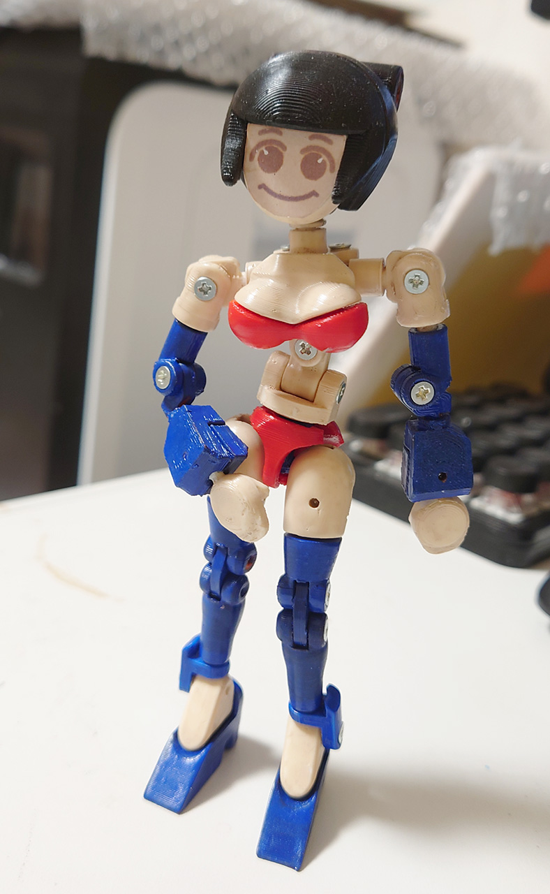
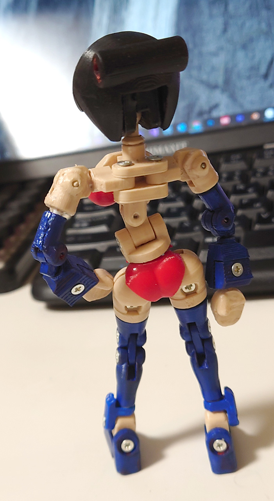
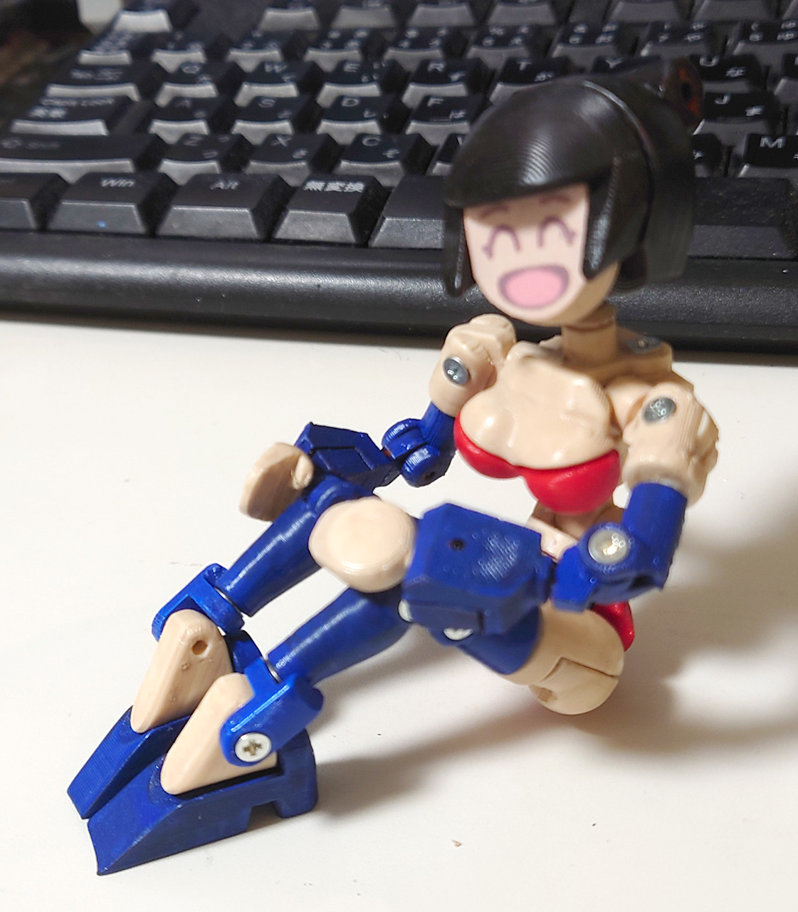

# SDRobo
2021/08/29 
アクリジョンのエアブラシ塗りに挑戦。 
遮蔽力が無くて泣きそうになった。

2021/08/26 
クレオスのアクリジョンのテスト。 
とりあえず、表面処理（ヤスリがけ・パテ盛り）なし、サフなしで筆塗りしてみた。 
ABS割れなしで無事にぬれたが、まあそれなりな感じ。

2021/08/23 

新しい関節を思いついたのでそれの検証用に作ったもの。 
顔はテストなので作ってません。顔シールでも貼って見ようかと思ってます。

肩の関節は、ワンプレートソルシャーのパクリ。ただネジ関節なのであそこまでコンパクトには出来なかった。 
基本関節と装飾部分を分けて作業できるようにしてある。 
頭は関節部と顔・前髪・後ろ髪と分けてある。腰もパンツ部分は前後3mm軸にはめ込むスタイル。胸も 
次の設計では腕・足・腰にも3mm軸のハードポイントを作る予定。

関節は印刷しながら調整したので自由度はかなり良い。まぁ外装つけるとかなり干渉しそう。

# Authors

bry-ful(Hiroshi Furuhashi)
twitter:[bryful](https://twitter.com/bryful)
bryful@gmail.com

