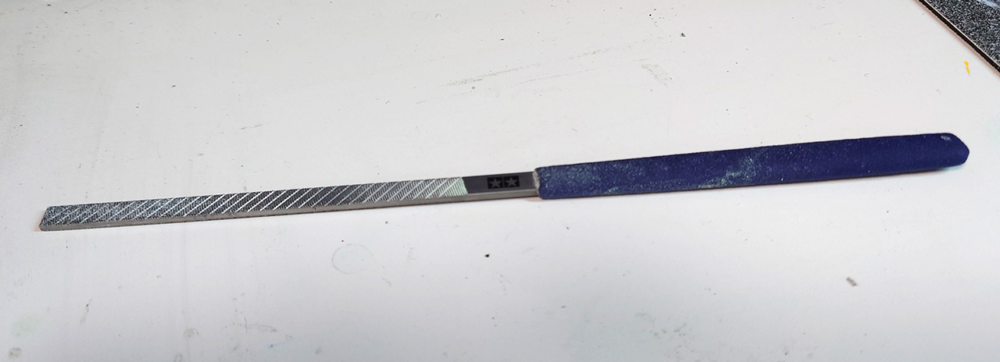
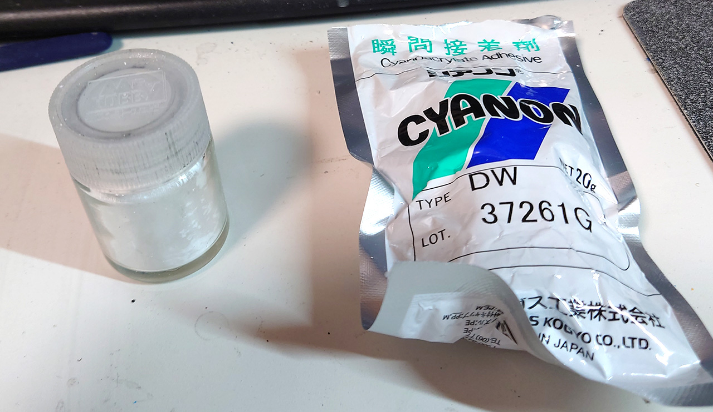

# 3Dプリンタの塗装手順メモ

## このメモについて
3Dプリンタはいろいろ出来て楽しいのですが、フィラメントの色が少なすぎて悲しいです。
色つきフィラメントは一応あるのですが、なんかいい色なくて・・・ 
（FLashforgeのドールカラーはなかなか良かったです） 
少し色を使いたいのに1kgとか買うのは流石に辛いです。しかも予想以上にフィラメントの劣化って激しくて保存にもかなりのコストがかかります。 
 
じゃあプラモみたいに塗装すればいいんじゃないかと試した結果のメモです。 
 

更新しました。

***

## Step.1 表面処理1　傷消し

印刷物には3Dプリンタ特有の「積層痕」があります。あと、結構傷も 
塗装前にそれらを補修して消します。まぁ、面倒な時はこの工程は省くことあります。 

* 印刷終わったら、簡単にヤスリがけして表面のバリを落とす。 
タミヤの「クラフトヤスリPRO 平 6mm」が異様に使いやすい。他のヤスリだと削った後がざらざらになるけどこいつはかなりつるつるになるのでおすすめ 
 
* クレオスの溶きパテで積層痕を消す。
 
積層痕はほぼ全面になるので通常のパテだと塗るの大変・乾燥時間長い・削り大変なので溶きパテはかなり楽。 
ただ、シンナーによるABS割れを引き起こすので、塗る時は面相筆で少しずつ乾燥させながら塗ること。 
事前にアクリジョンベースで下地を作っておくとABS割れをかなり防げるが、時間がかかるから普段はやらない。 
白いフィラメントに塗るとどこに塗ったか分からなくなるから適当なラッカーで色つけると楽。
 

* シアノン瞬間接着剤＋シッカロールで傷消し 
 
瞬間接着剤シアノンにシッカロールを練り込んだもので、大きな傷を消す。溶きパテの前後でおこなう。 
シアノン以外の瞬間接着剤で試したが、すぐ固まる、堅くて削りにくいのでシアノン以外は使わない方が良い。ABS印刷物はかなり柔らかいから堅いとかなり面倒。 
 
3D印刷物の場合いくらやっても傷が取れない。作業中に積層ハガレが起きる。となかなか傷が取れないので精神的に凄いストレスがあるので、適当な段階で諦めることが肝心。 
僕はもう諦めてます。 
パテもって削って形整えてると、これ3Dプリンタで作らないで最初からプラ板とパテで作った方が早いことがあるので。 
 

***

## Step.2 表面処理　塗装下地
大きな傷を消したら本塗装の下地処理をする。プラモデルの場合サーフェーサーを噴くのだが、含まれるシンナーがABS割れ起こすのでABS印刷物ではあまりよろしくない。 
クレオスの<b>アクリジョンベース</b>が唯一ABSにサフ効果があって安心してぬれる塗料になる。 
水性サーフェーサーがクレオスから販売されているが僕は試したことが無い。アルコール溶剤なので、通常のサーフェーサーよりは大丈夫だと思う。 
 
アクリジョンベースで下地が出来れば、後はラッカーとか水性ホビーカラーとか結構好きにぬれます。 
でも、ABS割れが怖いのでラッカーは避けた方がベター。アクリジョンか水性ホビーカラーがベストです。僕は使ったことないけどファレボとかシタデルも良いはずです。 

***

### アクリジョン・アクリジョンベースのエアブラシの注意点
アクリジョン塗装は筆塗りも良いけど、エアブラシだと簡単にきれいにぬれる。 
ただ、アクリジョンは凄い癖がある。ラッカー噴く要領で使うと絶対に失敗する。ここでは注意点を。 
基本的にノズル詰まり対策です。 

* 塗料はよくかき混ぜろ。 
攪拌は重要。特に新品を開けた時はかなりドロリとしているので10分以上はかき混ぜる。 
調色したり薄め液を入れた時も良くかき混ぜる。 
アクリジョンは顔料が溶剤に溶けているわけでないので色がかなり分離している。良くかき混ぜておかないと色が全然違ったものになる。 
<b>ただし、ビンの状態で振ってかき混ぜるのは絶対にしてはいけない。</b>泡だらけになる。アクリジョンは空気に触れると硬化が凄く早まるので、泡が出来ると細かい硬化した粒ができてエアブラシを簡単に詰まらせる。 
 

* エアブラシはノズル0.5mm 
0.3mm/0.4mmとかでも噴けることは噴けるがメンテが大変すぎる。 
特にUSB充電式のエアブラシでアクリジョンは相性が悪い。分解不可能なパーツが多くて塗料が入り込んで固まってしまうとすぐに壊れる。 
ハンドピースとコンプレッサーは別になっていた方が良い。0.5mmの充電式のエアブラシがほとんど無いので。 
 

* エアブラシに入れる時は必ず茶こしで濾してから。 
どんなに注意してもビンの側面に乾ききったゴミが出来る。 
固まったアクリジョンは溶剤で溶かすことが出来ない（ツールクリーナーで溶かしたアクリジョンはもう硬化しない）ので、それがそのままエアブラシに入るとノズルが詰まる。 
 
* 使用中はエアブラシのノズルは水に浸しておく。 
ノズル先端に残った塗料はすぐに乾燥して硬化します。ノズルを水に浸しておけばそれを防ぎます。 
5分くらい吹き続けててもノズル先端についた塗料が硬化してしまうので定期的に水に濡らしてそれを防ぐ。 
ノズルに入った水は空噴きすれば大丈夫。 
 

* 余った塗料は破棄すること。元のビンに戻すのはNG。 
アクリジョンはいったん薄めると元には戻らない。次の調整が難しくなるので戻してはいけない。 
また空気に触れたアクリジョンは細かい硬化したゴミが必ず出来ているので、それをあるとどんどん硬化していく。

* うすめ液は最低で「精製水」なるべく「エアブラシ専用うすめ液」を使う 
アクリジョンは水性なので水で薄めることが出来るが、水道水で薄めるのはNG。 
水道水は意外とゴミや化学物質が入ってるのでそれが原因でノズル詰まりが起きやすくなる。 
コンタクトレンズなんかで使う「精製水」が何も入っていない純水で一番手に入りやすいのでそれが最低限。専用の「エアブラシ薄め液」は現在全く手に入らないので、僕はもっぱら「精製水」を使ってる。 
ただ、水だと乾燥がべらぼうに早く、尚且つアクリジョン塗料との分離が非常に起きやすい。 
「専用うすめ液」がリターダー成分多めに入っているらしいので数滴加えておく（気休め） 
上記のことがあり水だとプラへの食いつきが弱い。はやく「エアブラシ薄め液」が再販してくれるとありがたい。 
代用品としてホルベインの「ペンチングソルベント」が使える。まだ僕自身使い始めて間もないがノズル詰まりが減った。プラへの食いつきが良くなった気がする。 
アルコール溶剤なのでABSへの影響が心配だが、作業が楽になるので今後使い続ける予定。 
 
* 色を変更する毎にエアブラシを洗浄する。 
アクリジョンは水性なので水で「うがい」が出来る。「マジックリン」を使ったうがいも効果的（マジックリンは最後の洗浄で） 
 
ただ、「うがい」だけでは駄目。色の混色は「うがい」で十分に防ぐことが出来るが、硬化したゴミは取れない. 
ノズル先端にこびりついた塗料を綿棒で取る。出来れば針の洗浄も行う事。 
 

## Step.3 本塗装
本塗装は下地がちゃんと出来ていれば普通のプラモの解説を参考にすればOK。
僕は水性ホビーカラーをよく使う。 
サフを噴くのが時間が無くて面倒な場合やデザイン的に積層痕があっても問題ない時は、アクリジョンでそのまま塗装してる。 
<b>アクリジョンだけで簡単に塗装するのが一番簡単でおすすめ</b>積層痕なんて気にしない! 
 

## Step.4 トップコート
トップコートはようは透明（クリア）な塗装をすること。 
僕は今までデカールの剥がれ防止や皮膜が弱い塗料の保護用としか思ってなかったが、実際噴き比べてみると全然違った。 
トップコートは質感（マテリアル）の統一化の効果が凄い。やるやらないで印象が全然違う。 
複数の色フィラメントを使って3D印刷物を作ると、その部品感というか違うものを組み合わせて作ってる感が凄い。塗装しても、してるところといないところの質感の差が凄いでるのと同じ感じ。 
最初、3D印刷物を全塗装するのでは無く一部だけ塗装していたが、その質感の差が気になって結局、全塗装にすることがあった。 
ある時塗装してないところをついでだから同じクリアで塗ってみたら、凄い一体感が出てびっくりした。 
それ以後トップコートだけは必ずするようになった。極端な場合色塗らない時もトップコートだけはするようになった。

### トップコートのメリット
* 質感の統一。
* つけ消し・光沢を調整できる。
* 傷や積層痕があっても、結構気にならなくなる。塗りむらも

### トップコートの注意点
* 塗装した場合は、水性ホビーカラーのクリア（光沢・つや消し）がおすすめ 
ラッカー、水性ホビーカラー、アクリジョンで本塗装してても大丈夫。 
本塗装がラッカーの時はラッカーのクリア使った方が良いかも？ 
 

* 無塗装の場合はアクリジョンクリアー 
アクリジョンのクリアーはなんか白く濁る気がするからあまり使わなくなったけど、ABS割れ対策でアクリジョンです。 
 

* 本塗装が完全乾燥してからトップコートすること。 
乾燥状態が不十分な状態にクリアを噴くと色がかなり変わる。特にアクリジョンの場合隠蔽力が弱いので、下地のサフの色がにじみ出てきてあまりよろしくない状態になってしまう。 
 

# Authors

bry-ful(Hiroshi Furuhashi)
twitter:[bryful](https://twitter.com/bryful)
bryful@gmail.com

